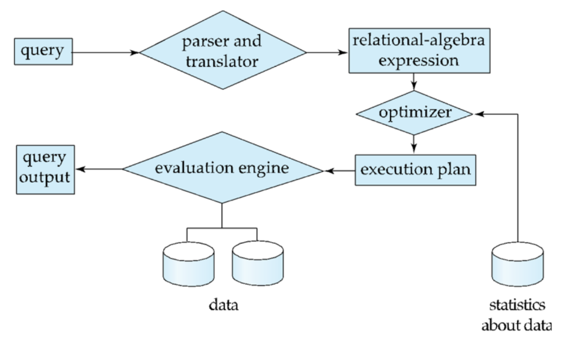

---
format:
  html: default
---

## Database Design

Database design primarily involves designing the database schema to manage large, interconnected bodies of enterprise information.

- __User Requirements Specification__ : Fully characterize and document the data needs of prospective database users.

- __Conceptual Design__ : Translate user requirements into a high-level, detailed conceptual schema of the database, focusing entirely on data modeling rather than physical implementation constraints.

- __Logical Design__ : Map the abstract, high-level conceptual schema onto the system-specific implementation data model of the chosen Database Management System (DBMS).

- __Physical Design__ : Specify the internal and low-level physical features of the database configuration.

## Database Engine

A database system is partitioned into independent modules that isolate core responsibilities. The database engine can be broadly divided into three main functional segments: the storage manager, the query processor, and the transaction manager.

### Storage Manager 
The storage manager acts as the operating interface between the low-level data stored on disk hardware and the application programs or queries submitted to the system. 

- Validates user access permissions and tests whether newly modified data satisfies established consistency constraints.
- Keeps the global database in a correct state despite hardware crashes and prevents operational conflicts between concurrent tasks.
- Directs the physical allocation of disk space and manages the underlying byte structures used to represent database records.
- Coordinates caching strategies, determining when to fetch data from physical storage into volatile main memory so data pools can scale larger than the computer's actual RAM capacity.

### Query Processor
The query processor abstracts execution details so developers can focus on writing high-level declarative commands, translating text into optimized sequences of lower-level physical operations.

- __Parsing and Translation__ : When you submit a query, the system can't read it as raw text. The DDL Interpreter handles structural commands and updates the data dictionary. For data modifications, the DML Compiler parses your syntax for correctness and translates the declarative text into a relational-algebra expression (an internal mathematical representation the system can work with).

- __Optimization__ : A single query can be executed using many alternative strategies, called evaluation plans. They all give the exact same output, but some consume drastically less hardware resources. The Query Optimizer calculates the estimated computational cost (disk I/O and CPU time) for each plan and programmatically selects the absolute most efficient one.

- __Evaluation__ : The execution layer takes over. The Query Evaluation Engine takes those optimized, low-level instructions, executes them directly against the physical database files, and returns a clean result table back to the user.

### Transaction Management 
A transaction is a collection of separate program operations that perform a single logical function within an application. The transaction manager allows developers to treat multiple database updates as a single unit of work by enforcing the core ACID properties.

- Maintains system safety and manages failure recovery. It automatically detects system crashes and uses logging protocols to reverse or restore data back to the clean state that existed prior to the failed transaction.
