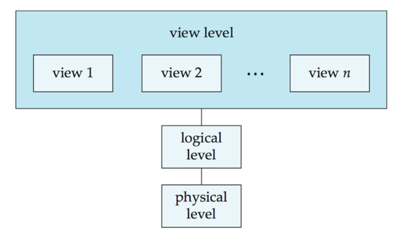
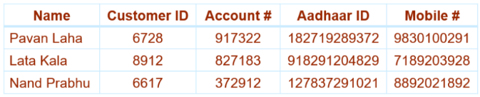

---
format:
  pdf: default
  html: default
---

## View of Data

### Data Abstraction

Abstraction refers to the hiding of implementation details to simplify the user interactions with the system. 



- __Physical level__ : Describes *how* the data is actually stored. It describes complex low-level data structures in detail. 

- __Logical level__ : Describes *what* data is stored in the database, along with the relationships that exist between them. 

- __View level__ : This is the highest level of abstraction that simplifies the user interaction by describing only the necessary part of the database. The system may provide different views for the same database.

### Schema and Instance

- __*Schema*__ refers to the overall design of the database. Database systems have several schemas, partitioned according to the levels of abstraction:

    - __Physical schema__ : Describes the overall physical design of the database at the physical level.

    - __Logical schema__ : Describes the overall logical design of the database at the logical level.

    

- __*Instance*__ refers to the collection of information stored in the database at a given point of time.
    

- __*Physical Data Independence*__ refers to the ability to modify the physical schema without changing the logical schema. This ensures that the different interfaces are defined such that any changes in one of the levels does not seriously influence others.

- __*Logical Data Independence*__ refers to the ability to modify the logical schema without affecting the view level.

## Database Languages

- __Data Definition Language (DDL)__ : 
    - The Data-Definition Language is used to specify the database schema and add structural properties or constraints to the data.
    - The processing of DDL statements generates metadata (data about data), which is stored securely in a centralized data dictionary. This directory is a special set of system tables that regular users cannot modify directly; the database system consults it before reading or altering any live data.
    - Example: 
    ```sql
    create table department(dept_name char(20),  
                            building char(15),  
                            budget numeric(12,2),  
                            primary key (dept_name));
```

- __Data Manipulation Language (DML)__ : 
    - The Data-Manipulation Language enables users to access or alter data organized under the schema. DML handles information retrieval (queries), insertions, deletions, and updates.
    - Example:
    ```sql
    select instructor.name
    from instructor
    where instructor.dept_name = 'History';
```
