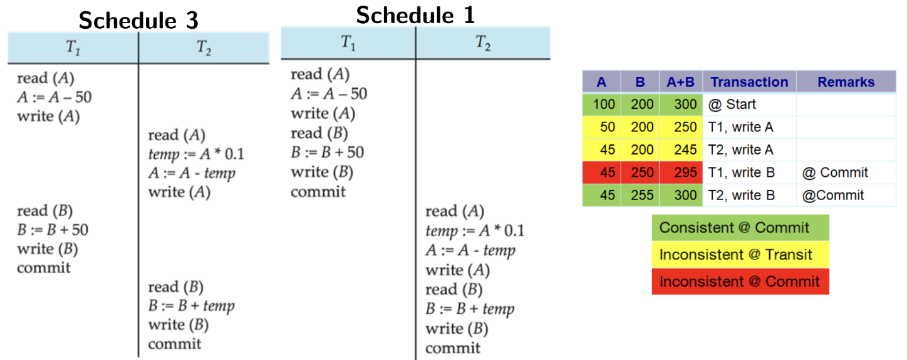
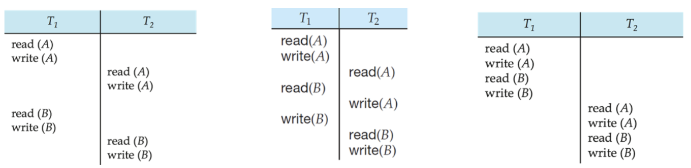
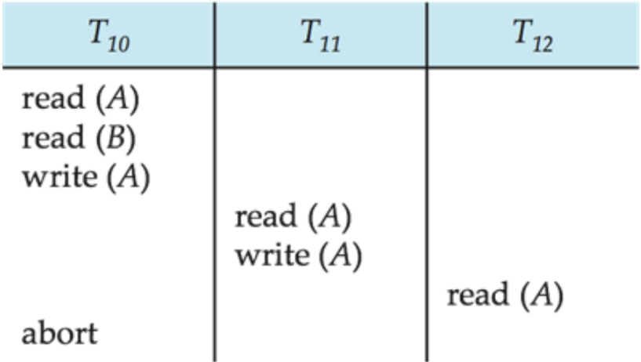

## What is a Schedule?

When multiple transactions are executed concurrently, their instructions are interleaved. A **Schedule** is simply a sequence of instructions that specifies the chronological order in which the instructions of concurrent transactions are executed.

- A schedule must consist of *all* instructions from the participating transactions.
- It must preserve the order in which the instructions appeared in their original transactions.

### Serial vs. Concurrent Schedules
- **Serial Schedule:** Transactions run one after the other. Transaction A finishes completely before Transaction B begins. This guarantees database consistency, but it is extremely slow.
- **Concurrent Schedule:** Instructions from multiple transactions are interleaved. This improves performance and resource utilization, but risks creating an inconsistent database state.

{width="80%"}

---

## Serializability

A concurrent schedule is considered **Serializable** if its final outcome is identical to that of some purely serial schedule. If we can prove a schedule is serializable, we guarantee it preserves database consistency!

There are two primary ways to determine this: **Conflict Serializability** and **View Serializability**.

### 1. Conflict Serializability

To understand conflict serializability, we first need to define what a "conflict" is.

::: {.callout-note title="Conflicting Instructions"}
Let $I_i$ and $I_j$ be two instructions from different transactions, operating on the *exact same* data item $Q$ (e.g. a column in a table, like `student_name`).

- $read(Q)$ and $read(Q)$ $\rightarrow$ **NO CONFLICT**
- $read(Q)$ and $write(Q)$ $\rightarrow$ **CONFLICT**
- $write(Q)$ and $read(Q)$ $\rightarrow$ **CONFLICT**
- $write(Q)$ and $write(Q)$ $\rightarrow$ **CONFLICT**

If an instruction is just a read, they don't conflict. If at least one instruction is a write, they conflict because the order in which they are executed changes the final value or the value read!
:::

If a concurrent schedule can be transformed into a serial schedule by swapping *non-conflicting* adjacent instructions, we say the schedule is **Conflict Serializable**.

{width="70%"}

#### The Precedence Graph
Checking every possible swap is tedious. Instead, we use a **Precedence Graph**:

1. Draw a node for each transaction.

2. Draw a directed edge from $T_i$ to $T_j$ if they have conflicting instructions and $T_i$ executed first.

::: {.callout-important title="The Acyclic Rule"}
A schedule is conflict serializable **if and only if** its precedence graph contains NO cycles (it is acyclic).
:::

{width="90%"}

*(Note: If the graph is acyclic, you can use topological sorting to find the exact serial execution order).*

### 2. View Serializability

View serializability is a slightly looser definition than conflict serializability. Two schedules are "view equivalent" if they meet three conditions for every data item:

1. **Initial Read:** If $T_i$ reads the initial value of $Q$ in the first schedule, it must do so in the second.

2. **Write-Read Pair:** If $T_j$ reads a value of $Q$ written by $T_i$ in the first schedule, it must read the value written by that exact same $T_i$ in the second.

3. **Final Write:** The transaction that performs the *last* write to $Q$ must be the same in both schedules.

Every conflict-serializable schedule is view-serializable. However, some view-serializable schedules are *not* conflict-serializable. This usually happens when there are **Blind Writes** (writing to a variable without ever reading it first).

---

## Recovery and Cascading

If a transaction fails halfway through, we must roll it back to maintain the ACID property of Atomicity. This rollback process is known as **Recovery**. However, rolling back one transaction can cause a domino effect.

### Recoverable Schedules
If Transaction B reads data written by Transaction A, then A **must commit before** B commits. 

{width="60%"}

### Cascading Rollbacks
Even if a schedule is recoverable, we can run into **Cascading Rollbacks**. If one transaction fails, every other transaction that read its dirty data must *also* be rolled back. This wastes a massive amount of computational work.

{width="60%"}

### Cascadeless Schedules
To prevent cascading rollbacks, databases enforce **Cascadeless Schedules**. 
Rule: Transaction B cannot even *read* data written by Transaction A until Transaction A has fully committed. 
*(Note: Every cascadeless schedule is inherently recoverable).*

---

## TCL (Transaction Control Language)

How do we actually manage these transactions in SQL? We use TCL commands!

- `COMMIT` - Saves all changes permanently. The transaction is successfully concluded.
- `ROLLBACK` - Undoes all changes made during the current transaction.
- `SAVEPOINT` - Creates a bookmark within a transaction. You can choose to rollback to a specific savepoint instead of rolling back the entire transaction.
- `SET TRANSACTION` - Can be used to set properties, like making the transaction Read-Only.

```sql
-- An example of using Savepoints
UPDATE Employee SET EName = "Janie" WHERE EID = "E06";
SAVEPOINT SP1;

DELETE FROM Employee WHERE EID = "E02";
SAVEPOINT SP2;

UPDATE Employee SET EName = "Raina" WHERE EID = "E04";

-- Oops, we didn't mean to delete E02! Let's rewind to SP1.
ROLLBACK TO SP1;
```
