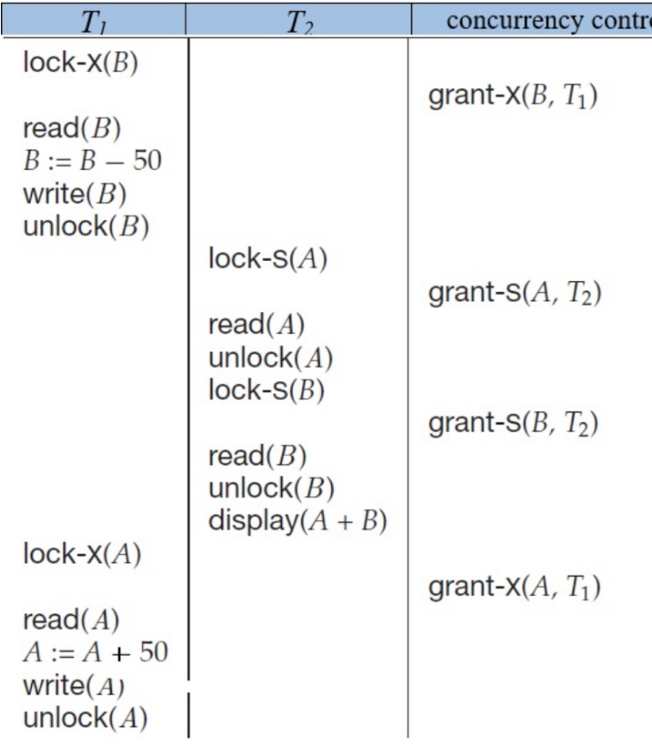

## The Need for Concurrency Control

We know that a schedule must be both **conflict serializable** and **recoverable** (preferably cascadeless). However, allowing transactions to just run wildly and hoping the schedule turns out serializable is a terrible strategy.

The database needs a **Concurrency Control** mechanism to enforce these rules dynamically as transactions arrive.

{width="80%"}

There is always a trade-off: The more strict the concurrency control scheme, the safer the data is, but the slower the database runs (because transactions have to wait in line).

---

## Lock-Based Protocols

The most common way to control concurrency is by using **Locks**. Think of a lock like a bathroom key. If someone has the key, nobody else can enter until they give it back.

Data items can be locked in two modes:

1. **Exclusive (X) mode:** The data item can be both read AND written.

2. **Shared (S) mode:** The data item can ONLY be read.

### The Lock-Compatibility Matrix
Before a transaction can lock an item, it must request it from the lock manager. The lock manager checks the compatibility matrix:

| State of the lock | Request: Shared | Request: Exclusive |
|:---:|:---:|:---:|
| **Shared** | Yes | No |
| **Exclusive** | No | No |

- **Sharing is caring:** Any number of transactions can hold Shared locks on the same item at the same time (since reading doesn't change the data).
- **Exclusivity:** If *any* transaction holds an Exclusive lock, no other transaction can hold *any* lock on that item. They must wait.

*A transaction must hold a lock on a data item for as long as it is actively accessing it. Once it's done, it releases it using the `unlock(Q)` instruction.*

---

## The Two-Phase Locking Protocol (2PL)

Just having locks isn't enough to guarantee serializability. If a transaction locks an item, modifies it, unlocks it, and *then* locks another item, we can still run into consistency issues.

To solve this, databases use the **Two-Phase Locking (2PL)** protocol. Under 2PL, every transaction goes through two distinct phases:

1. **Growing Phase:** 
   - A transaction may obtain new locks.
   - It may **not** release any locks.
2. **Shrinking Phase:**
   - A transaction may release locks.
   - It may **not** obtain any new locks.

Once a transaction releases its very first lock, it has entered the Shrinking Phase and can never request another lock again.

### Lock Conversions
During these phases, 2PL allows locks to be converted:

- **Growing Phase:** You can upgrade a Shared lock to an Exclusive lock.

- **Shrinking Phase:** You can downgrade an Exclusive lock to a Shared lock.

---

## Stricter Variants of 2PL

Standard 2PL guarantees serializability, but it does NOT guarantee cascadeless schedules. If a transaction fails during its Shrinking Phase after releasing some locks, other transactions might have already read its dirty data!

To prevent cascading rollbacks, databases use stricter versions of 2PL:

### Strict Two-Phase Locking
- Standard 2PL rules apply.
- **Addition:** A transaction must hold all of its **Exclusive** locks until it fully commits or aborts. 
- *Why?* This guarantees that no other transaction can read its uncommitted changes.

### Rigorous Two-Phase Locking
- Standard 2PL rules apply.
- **Addition:** A transaction must hold **ALL** of its locks (both Shared and Exclusive) until it commits or aborts.
- *Why?* It is even safer and easier to implement, and transactions can be serialized in the exact order they commit. 

::: {.callout-warning title="The Trade-off"}
As we move from standard 2PL $\rightarrow$ Strict 2PL $\rightarrow$ Rigorous 2PL, the system becomes safer and simpler. However, **Concurrency goes down**. Because locks are held longer, other transactions are forced to wait longer, slowing down the overall system performance.
:::
