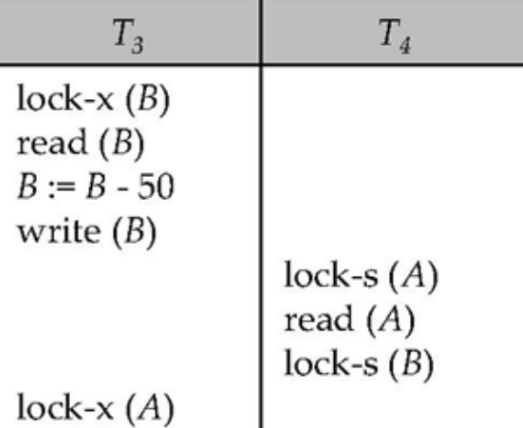

## Understanding Deadlocks

Locking protocols solve the problem of inconsistency, but they introduce a new problem: **Deadlock**.

Imagine Transaction A holds a lock on item X and is waiting for a lock on item Y. Meanwhile, Transaction B holds a lock on item Y and is waiting for a lock on item X. 

Neither transaction can ever proceed. They are stuck waiting for each other indefinitely.

{width="60%"}

When a deadlock occurs, the system has no choice but to intervene. It must **roll back (abort)** one of the transactions to break the cycle and release its locks so the other can proceed.

### Starvation
A related issue is **Starvation**. This occurs when a badly designed concurrency control manager repeatedly forces a transaction to wait forever, even without a deadlock. 
For example, if Transaction A wants an Exclusive lock, but a continuous stream of new transactions keep requesting and getting Shared locks on that item, Transaction A will starve. Alternatively, a transaction might be repeatedly chosen as the "victim" to be rolled back during deadlocks, never getting a chance to finish.

---

## Deadlock Prevention

Rather than letting deadlocks happen and fixing them later, databases can use schemes to prevent them from ever occurring. These schemes often use **Transaction Timestamps**.

A Timestamp is a unique identifier assigned by the database that represents the exact moment a transaction started. An older transaction has a smaller timestamp, while a younger transaction has a larger timestamp.

### 1. The Wait-Die Scheme (Non-Preemptive)
*Rule: Older transactions wait for younger ones. Younger transactions die.*

If Transaction A requests a lock held by Transaction B:

- If A is **older** than B $\rightarrow$ A is allowed to **wait**.

- If A is **younger** than B $\rightarrow$ A is killed (**dies**) and rolled back.

### 2. The Wound-Wait Scheme (Preemptive)
*Rule: Younger transactions wait for older ones. Older transactions wound (kill) younger ones.*

If Transaction A requests a lock held by Transaction B:

- If A is **older** than B $\rightarrow$ A forces B to be killed (**wounds** it). B is rolled back and restarted later.

- If A is **younger** than B $\rightarrow$ A is allowed to **wait**.

---

## Deadlock Detection

If a database doesn't use prevention schemes, it must periodically check for deadlocks using a **Wait-For Graph**.

- **Vertices (Nodes):** Represent active transactions.
- **Edges:** A directed edge from $T_i$ to $T_j$ means that $T_i$ is waiting for $T_j$ to release a lock.

::: {.callout-important title="The Cycle Rule"}
The system is in a deadlock state **if and only if** the wait-for graph has a cycle.
:::
If a cycle is detected, the database selects a "victim" transaction and rolls it back.

---

## Timestamp-Based Protocols

What if we didn't use locks at all? Another way to handle concurrency is by strictly enforcing execution based on timestamps. 

Every data item Q in the database maintains two timestamps:

- **W-timestamp(Q):** The largest timestamp of any transaction that successfully *wrote* to Q.

- **R-timestamp(Q):** The largest timestamp of any transaction that successfully *read* Q.

### Read and Write Rules

Suppose Transaction $T_i$ wants to **read(Q)**:

- If $TS(T_i) < W\text{-timestamp}(Q)$: This means a *younger* transaction has already overwritten the data! $T_i$ is trying to read the past. The read is rejected, and $T_i$ is rolled back.

- If $TS(T_i) \ge W\text{-timestamp}(Q)$: The read is allowed! We update $R\text{-timestamp}(Q)$ if $T_i$'s timestamp is larger.

Suppose Transaction $T_i$ wants to **write(Q)**:

- If $TS(T_i) < R\text{-timestamp}(Q)$: A younger transaction has already read the data assuming $T_i$'s write never happened. The write is rejected, and $T_i$ is rolled back.

- If $TS(T_i) < W\text{-timestamp}(Q)$: A younger transaction has already overwritten the data. The write is rejected, and $T_i$ is rolled back.

- Otherwise, the write is allowed, and $W\text{-timestamp}(Q)$ is updated.

### Correctness and Drawbacks
- **Pros:** It guarantees serializability and inherently prevents deadlocks (because no transaction ever waits for a lock—they just execute or get rolled back).
- **Cons:** It does NOT guarantee cascadeless or recoverable schedules, so transaction failures can cause significant cascading rollbacks.
