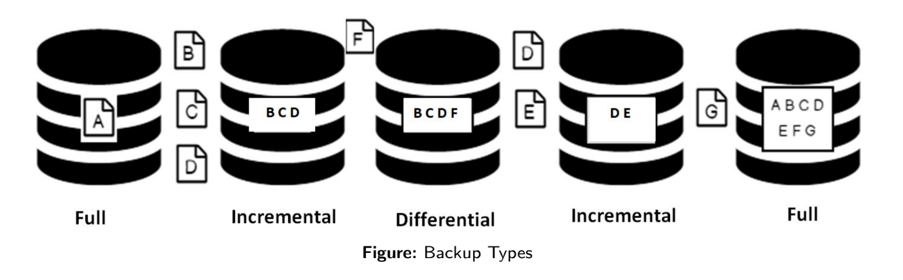

## What is Backup and Recovery?

Imagine your database crashes due to a power failure. Without a backup, everything is gone. A **backup** is a copy of your database — data files, control files, logs — that lets you restore the system when something goes wrong.

**Recovery** is the process of using that backup to bring the database back to its last consistent state.

---

## Types of Data to Back Up

- **Business Data** — includes personal information of clients, employees, contractors etc. along with details about places, things, events and rules related to the business.
- **System Data** — includes specific environment/configuration of the system used for specialised development purposes log files, software dependency data, disk images.
- **Media Files** — files like photographs, videos, sounds, graphics etc. need backing up. Media files are typically much larger in size.

---

## Backup Strategies

### Full Backup

A full backup copies *everything* — tables, indexes, views, procedures. Think of it as a complete snapshot of the database at a point in time. It must be done **at least once** before any other strategy can be used.

| ✓ Advantages | ✗ Disadvantages |
|---|---|
| Simple — recovery needs just one backup set | Slowest to perform |
| No dependency between backups | Longest system downtime |
| Loss of one backup doesn't affect others | Uses the most storage |

---

### Incremental Backup

Instead of copying everything, an incremental backup only copies what has **changed since the last backup** (full or incremental).

| ✓ Advantages | ✗ Disadvantages |
|---|---|
| Smallest backup size | Recovery needs full + every incremental in sequence |
| Minimal downtime | Missing even one incremental breaks recovery |
| Most cost-efficient | Most complex to manage |

---

### Differential Backup

A differential backup copies everything that has **changed since the last full backup** — regardless of any incrementals in between. Recovery only ever needs two things: the last full backup and the most recent differential.

The longer you wait between differentials, the larger they grow — eventually approaching full backup size.

| ✓ Advantages | ✗ Disadvantages |
|---|---|
| Fewer backup sets needed for recovery | Larger than incremental backups |
| Great when full backups are infrequent | Grows over time if not managed |

---

### Comparing the Three

| | Full | Incremental | Differential |
|---|---|---|---|
| **What it copies** | Everything | Changes since last backup | Changes since last full |
| **Backup size** | Largest | Smallest | Medium (grows over time) |
| **Recovery sets needed** | 1 | Full + all incrementals | Full + latest differential |
| **Recovery complexity** | Simplest | Most complex | Moderate |

> A smart schedule: **full backup monthly + differential weekly + incremental daily**.

---

## Hot Backup

All the strategies above are **cold backups** — the database pauses during the backup. But some systems can never go offline: financial trading platforms, real-time sensor systems, satellite feeds.

**Hot backup** keeps the database fully live while the backup runs concurrently.

| ✓ Advantages | ✗ Disadvantages |
|---|---|
| Database stays available to users | Not feasible for very large, monolithic datasets |
| Point-in-time recovery is easier | Any error mid-backup can terminate the entire process |
| Efficient for dynamic, modular data | High setup and maintenance cost |

In practice: hot backup is used for **transaction log backups**. Data backups (incremental/differential) are done cold.
A **transaction log** records every database modification in sequence. Even if a data backup is slightly inconsistent (taken while the database was live), replaying the transaction log on top of it restores full consistency.
