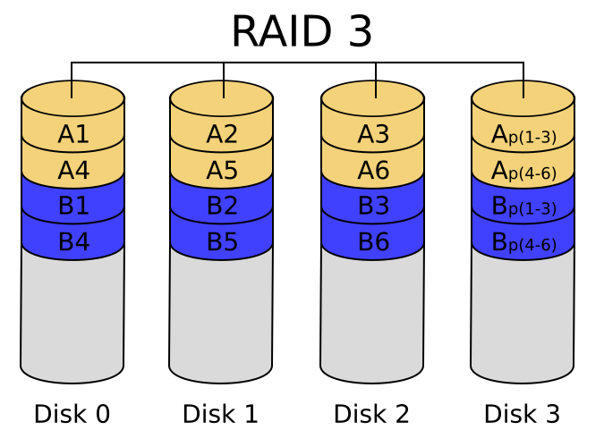
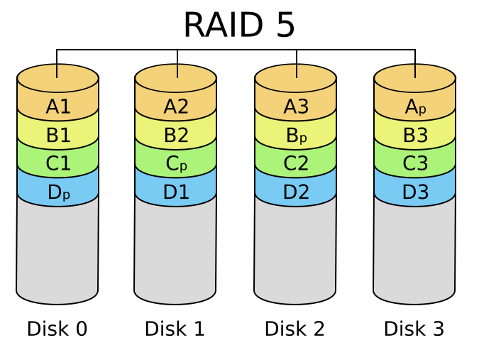
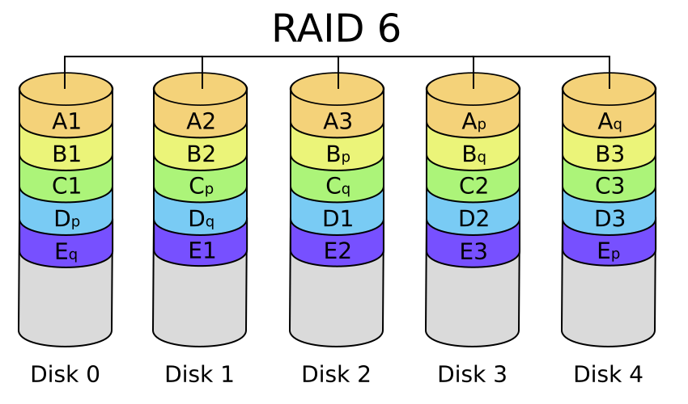
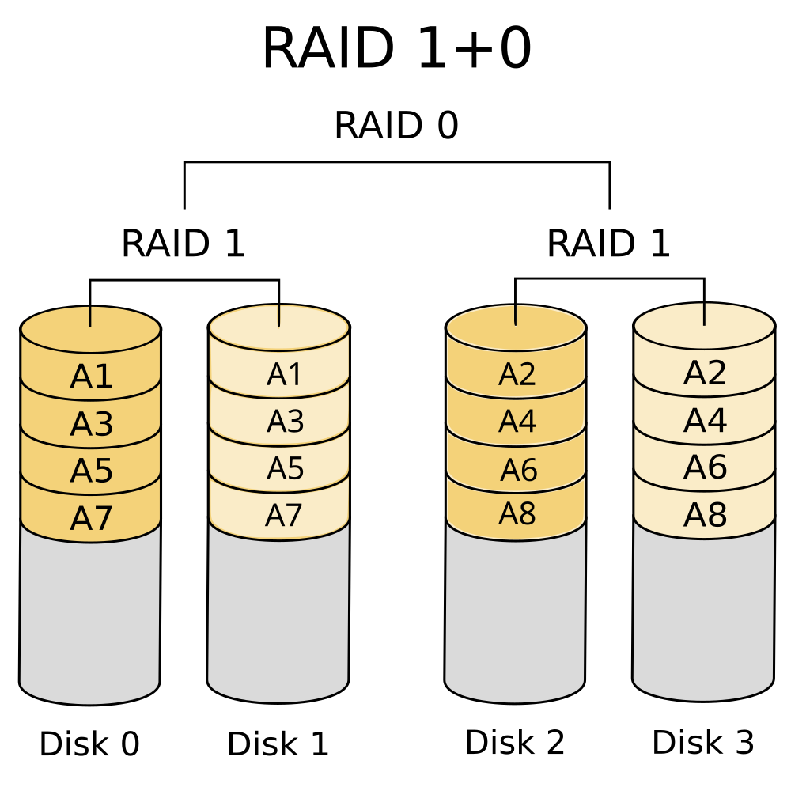

## What is RAID?

A single disk has two problems: it's slow, and it can fail. RAID solves both by combining multiple disks into what looks like one — spreading data across them for speed and duplicating it for safety.
**RAID (Redundant Array of Independent Disks)** is a disk organization technique that manages multiple disks and presents them as a single logical disk. It achieves two things simultaneously:

- **Speed** — by using multiple disks in parallel, it delivers high capacity and high throughput.
- **Reliability** — by storing data redundantly across disks, it ensures data can be recovered even if one disk fails.

---

## Three Core Techniques

### Mirroring

Every disk has an exact duplicate — the logical disk consists of two physical disks.

- Every write is carried out on **both** disks simultaneously.
- Reads can be served from **either** disk.
- If one disk in a pair fails, data is still available on the other.
- Data loss only occurs if both disks in a pair fail before one is repaired — extremely unlikely.

---

### Striping

Data is split across multiple disks so reads and writes happen in parallel.

**Bit-level Striping**

- Bits of each byte are split across multiple disks (bit $i$ goes to disk $i$).
- Each access reads data at up to 8× the rate of a single disk.
- Seek and access time is worse than a single disk — rarely used today.

**Byte-level Striping**

- Each file is split into 1-byte chunks distributed across disks.
- The $i$th byte goes to disk $((i-1) \mod n) + 1$.

**Block-level Striping**

- Block $i$ of a file goes to disk $(i \mod n) + 1$.
- Requests for different blocks can run in **parallel** if they reside on different disks.
- A long sequential read can utilise all disks at once.

---

### Parity

Parity provides fault tolerance by storing extra computed information alongside the data. If a disk fails, the lost data can be **reconstructed** from the remaining disks and the parity — without needing a full duplicate copy.

Parity is computed using **XOR**: for any set of bits, XOR of all bits including the parity bit equals zero. So if one disk's bits are lost, XOR of the remaining disks recovers them.

**Bit-interleaved Parity**

- One parity bit covers the corresponding bits across all data disks.
- Written to a dedicated parity disk on every write.
- On disk failure: XOR all remaining bits (including parity) to reconstruct the lost bit.

**Block-interleaved Parity**

- Uses block-level striping with a dedicated parity **block** (not just a bit) for every set of corresponding blocks across $n$ disks.
- On disk failure: XOR the corresponding blocks from all remaining disks to reconstruct the lost block.

---

## Standard RAID Levels

### RAID 0 — Block Striping

- Data is striped across disks with no redundancy whatsoever.
- Best write performance of all RAID levels — no parity to update.
- 100% storage efficiency.
- No fault tolerance — one disk failure loses everything.

---

### RAID 1 — Mirroring

- Every disk has an exact copy on a second disk. Every write of a disk block involves a write on both disks.
- Excellent fault tolerance — survives one disk failure.
- Reads can be served from either disk in parallel.
- 50% storage efficiency — half your disks are copies.
- Most expensive solution.

---

### RAID 2 — Parity

- Uses dedicated bit for parity and the striping is a single bit, uses Hamming codes for error correction.
- Can correct one-bit errors and detect two-bit errors.
- Requires multiple dedicated check disks.
- Not used in practice — subsumed by RAID 3.

---

### RAID 3 — Byte Striping + Parity

- Strips at the byte level with a single dedicated parity disk.
- High data transfer rate — data accessed in parallel across all disks.
- Cannot service multiple requests simultaneously — every request touches every disk.
- Reliability overhead for RAID 3 is a single disk, the lowest over-head possible.

---

### RAID 4 — Block Striping + Parity

- Strips at the block level with a single dedicated parity disk.
- Read requests can be served by a single disk — better than RAID 3 for reads.
- Can recover from one disk failure using XOR.
- Write performance is poor — every write hits the single parity disk, creating a bottleneck.

---

### RAID 5 — Distributed Parity

- Like RAID 4 but parity blocks are spread across all disks instead of sitting on one dedicated disk.
- Eliminates the parity bottleneck — multiple writes can happen in parallel.
- All disks participate in reads — higher read parallelism.
- Allows recovery of only 1 disk failure.

---

### RAID 6 — Dual Parity

- Extends RAID 5 with a second parity block, using Reed-Solomon codes.
- Survives **two simultaneous disk failures** — safe even during a rebuild after one failure.
- Write performance worse than RAID 5 — two parity blocks to update.

---

### RAID 01 — Mirror of Stripes

- Stripe sets are built first (RAID 0), then each set is mirrored (RAID 1).
- If one disk in a stripe fails, the entire stripe set is lost — falls back to the mirror.
- Less resilient than RAID 10.
- Requires at least 4 disks. Storage efficiency: 50%.

---

### RAID 10 — Stripe of Mirrors

- Disks are mirrored first (RAID 1), then striped across the mirror pairs (RAID 0).
- One disk in each mirror pair can fail independently — far more resilient than RAID 01.
- Best throughput and latency of all fault-tolerant RAID levels.

