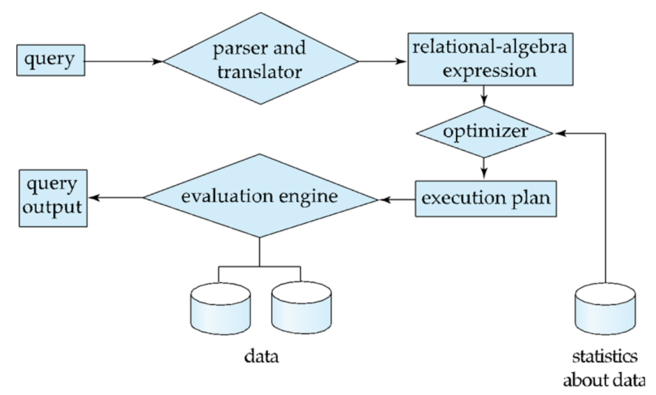

## Overview of Query Processing

When you submit a query to a database, it doesn't just execute it directly. It goes through a series of logical steps to ensure the query is valid and to find the most efficient way to execute it.

{width="90%"}

The process can be broken down into three main phases:

### 1. Parser and Translator
- **What it does:** The database receives the raw SQL query. It checks the syntax to ensure it's valid SQL, and verifies that the referenced tables and columns exist in the database schema.
- **Output:** It translates the query into an internal format, typically a relational algebra expression.

### 2. Optimization
- **What it does:** This is the most crucial step for performance. A single SQL query can often be executed in multiple ways (e.g., different join orders, using an index vs. scanning a table). 
- **The Optimizer's Job:** It analyzes these different strategies (execution plans), estimates the cost of each using available database statistics, and selects the one with the lowest overall cost.

### 3. Evaluation
- **What it does:** The query-execution engine takes the optimized query-evaluation plan and actually runs it against the data.
- **Output:** It returns the final result set (the answers) to the user.

---

## Measures of Query Cost

How does the optimizer determine the "cost" of a query plan? 

The true cost is generally measured as the **total elapsed time** required to answer the query. This involves several factors:

- Disk accesses (reading/writing data from/to storage)

- CPU time (processing the data)

- Network communication (if data is distributed)

However, because fetching data from disk is typically the slowest operation by a huge margin, we simplify the cost measure to focus primarily on disk I/O.

We measure cost using two main metrics:

1. **Number of block transfers ($b$):** The number of data blocks that must be read from or written to the disk.

2. **Number of seeks ($S$):** The number of times the disk head must move to a new location to read a block.

### The Cost Formula

We can estimate the time cost with this simple formula:

$$ \text{Cost} = (b \times t_T) + (S \times t_S) $$

Where:

- **$b$** = Total number of block transfers

- **$t_T$** = Time to transfer one block

- **$S$** = Total number of seeks

- **$t_S$** = Time for one seek
