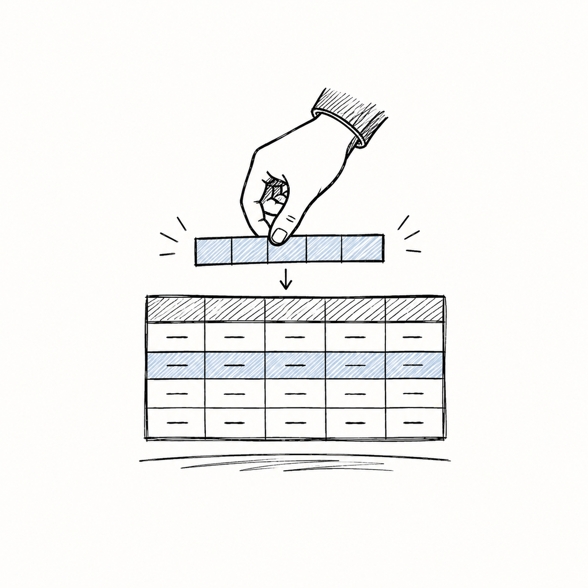

## DML: Furnishing the House

In the previous section, DDL acted as our architect—building the empty structure of our `student` table. Now, it's time for **DML (Data Manipulation Language)** to move the furniture in! DML handles all the inserting, modifying, and deleting of the *actual data rows*.

Let's start with an empty table:

| roll_no | name | level | course | term | grade |
|---|---|---|---|---|---|
| *(empty)* | | | | | |

### 1. `INSERT`: Adding New Records
A new student, Pravin, has just enrolled. We need to add him to our database.

```sql
INSERT INTO student (roll_no, name, level, course, term, grade) 
VALUES ('26f10', 'Pravin', 'Degree', 'DBMS', '27t1', 'S');
```
> **Tip:** You *can* write an `INSERT` without listing the column names (e.g., `INSERT INTO student VALUES (...)`), but specifying the columns as shown above is much safer! It prevents errors if someone later adds a new column to the table.

**Inserting Multiple Rows at Once:**
You can also insert several students in a single command by separating the values with commas!
```sql
INSERT INTO student (roll_no, name, level, course, term, grade) 
VALUES 
    ('26f11', 'Alice', 'Degree', 'Math', '27t1', 'B'),
    ('26f12', 'Bob', 'Diploma', 'Physics', '27t1', 'C');
```

**Our Table Now:**

| roll_no | name | level | course | term | grade |
|---|---|---|---|---|---|
| 26f10 | Pravin | Degree | DBMS | 27t1 | S |

### 2. `UPDATE`: Modifying Existing Data
Oops! We made a mistake. Pravin actually got an 'A' grade, not an 'S'. We don't delete his record; we just `UPDATE` it.

```sql
UPDATE student 
SET grade = 'A'
WHERE roll_no = '26f10';
```
> **[WARNING]**
> Always, *always* use a `WHERE` clause with `UPDATE`! 

**What happens if you forget the `WHERE` clause?**
If you simply ran `UPDATE student SET grade = 'A';`, it would ignore the individual student and change the grade of **every single student** in the entire database to an 'A'! 

| roll_no | name | grade |
|---|---|---|
| 26f10 | Pravin | **A** |
| 26f11 | Alice | **A** |
| 26f12 | Bob | **A** |
*(Oops! Alice and Bob just got free 'A' grades because you forgot the WHERE clause!)*

**Our Table After Correct Update:**

| roll_no | name | level | course | term | grade |
|---|---|---|---|---|---|
| 26f10 | Pravin | Degree | DBMS | 27t1 | **A** |

### 3. `DELETE`: Removing Records
Pravin has decided to transfer to another school. We need to remove his record completely.

```sql
DELETE FROM student 
WHERE roll_no = '26f10';
```
*(Just like `UPDATE`, forgetting the `WHERE` clause here would delete everyone!)*

---

## The Anatomy of a Query

Now that we have data, how do we ask the database questions? We write queries. 

Think of a SQL query like giving instructions to an incredibly fast, but very literal librarian. The fundamental structure requires three clauses:

```sql
SELECT <attributes>
FROM <tables>
WHERE <condition>;
```

Here is the mental model of how the librarian thinks:
1. **`FROM`**: *"Which section of the library (tables) should I go to?"*
2. **`WHERE`**: *"Which specific books (rows) should I pull off the shelf?"*
3. **`SELECT`**: *"Which chapters (columns) should I photocopy and give to you?"*

### The `SELECT` Clause in Detail
The `SELECT` clause dictates what the final output looks like.

- `*` : "Give me everything." (All columns)

- `DISTINCT` : "Remove any duplicate answers."

- `AS` : "Rename this column in the output just to make it look nicer."

- `TOP <n>` (or `LIMIT`): "Only show me the first `n` results."

**Example:**
```sql
SELECT DISTINCT(name) AS Instructor_Name
FROM instructor
WHERE dept_name = 'Biology';
```

### The `ORDER BY` Clause
By default, SQL returns rows in whatever internal order it feels like. If you want them sorted, you must explicitly use the `ORDER BY` clause at the very end of your query.

- `ASC`: Ascending order (A-Z, 1-10). This is the default.
- `DESC`: Descending order (Z-A, 10-1).

**Example:**
```sql
-- Sort instructors by salary from highest to lowest
SELECT name, salary
FROM instructor
ORDER BY salary DESC;
```

---

## The Danger of Cross Joins

What happens if you tell the librarian to get data from *two* places at once?

```sql
SELECT *
FROM instructor, course;
```

When you list multiple tables in the `FROM` clause without a `WHERE` condition, SQL performs a **Cross Join** (Cartesian Product). It pairs *every* row in the first table with *every* row in the second table. 

**Let's visualize this:**
If you have 2 Instructors and 2 Courses:

*Instructors Table:*

| id | name |
|---|---|
| 1 | Alice |
| 2 | Bob |

*Courses Table:*

| c_id | title |
|---|---|
| 101 | Math |
| 102 | Science |

*The Cross Join Result:*

| id | name | c_id | title |
|---|---|---|---|
| 1 | Alice | 101 | Math |
| 1 | Alice | 102 | Science |
| 2 | Bob | 101 | Math |
| 2 | Bob | 102 | Science |

*(2 instructors &times; 2 courses = 4 rows!)*

Imagine if you had 1,000 instructors and 1,000 courses—you'd instantly generate **1 million rows**! Most of these combinations are nonsense (Alice doesn't teach every single course).

### Fixing the Cross Join
To fix this, we use the `WHERE` clause to filter the massive Cross Join down to only the combinations that make sense (e.g., linking the instructor to the specific course they actually teach):

```sql
SELECT *
FROM instructor AS i, course AS c
WHERE i.course_id = c.course_id 
  AND i.dept_name = 'Biology';
```
*(Notice how we used `AS i` and `AS c` to give our tables nicknames? This makes our `WHERE` clause much easier to read!)*
