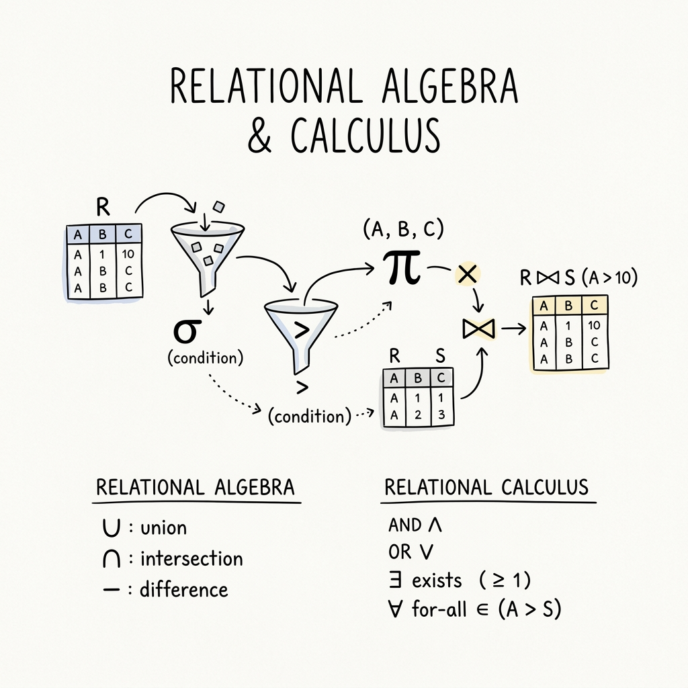
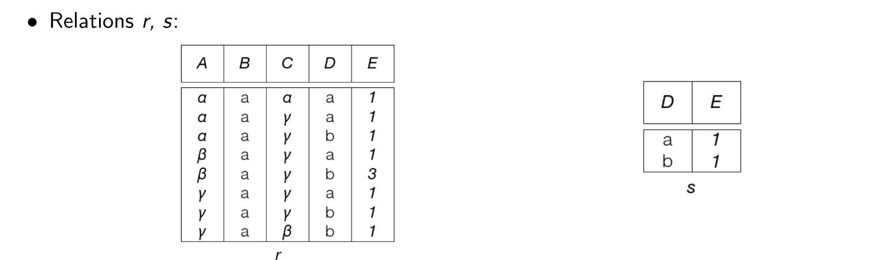

# Introduction to Query Languages

Query languages in DBMS are broadly classified into two categories:

1. **Procedural Query Languages**: The user specifies *what* data is needed and *how* to get it. Relational Algebra is a procedural language.
2. **Non-Procedural (Declarative) Query Languages**: The user specifies *what* data is needed without specifying *how* to get it. Relational Calculus is a non-procedural language.

---

# Relational Algebra (RA)

Relational Algebra is a procedural query language that takes one or two relations as input and produces a new relation as a result. The fundamental operations include:

- $\sigma$ - **Select**: Filters rows based on a given condition.
- $\pi$ - **Project**: Selects specific columns from a relation.
- $\neg$ - **Negation (Not)**
- $\cup$ - **Union**: Combines rows of two relations.
- $\cap$ - **Intersection**: Finds common rows between two relations.
- $\times$ - **Cartesian Product**: Combines each row of the first relation with each row of the second.
- $-$ - **Set Difference (Except)**: Finds rows present in the first relation but not in the second.
- $⋈$ - **Natural Join**: Combines two relations based on matching values in common attributes.

## Examples

**1. Find all the names of students whose age is greater than 25, or who are enrolled in Maths**

Schema:
- `Students(RollNo, Name, Age, Subject)`

First, we filter the `Students` table using the Selection ($\sigma$) operation for the condition `Age > 25 OR Subject = 'Maths'`. Then, we use the Projection ($\pi$) operation to only retrieve the `Name` attribute.

$$ \pi_{Name}(\sigma_{Age>25 \space \lor \space Subject='Maths'}(Students)) $$

**2. Find the name and sports of the student whose age is less than 25 and awards is greater than 3**

Schema:
- `Students(RollNo, Name, Age)`
- `Activity(RollNo, Sports, Awards)`

Here we need data from two different domains (the `Students` and `Activity` tables). We use a Natural Join ($⋈$) to combine them on their common attribute (`RollNo`), filter the result, and project the specific columns.

$$ \pi_{Name, Sports}(\sigma_{Age<25 \space \land \space Awards>3}(Students ⋈ Activity)) $$

## Division Operation

The **Division ($r \div s$)** operation is used in queries that involve the word "every" or "all". For example, "Find students who have taken *all* courses offered in the Biology department."

Suppose we have two relations: $r(A, B, C)$ and $s(B, C)$. The result of $r \div s$ will be a relation with the attribute $A$, containing values of $A$ that match with *all* the tuples present in $s$.

{width=80%}

In the mathematical example from the notes, if we perform $r \div s$:

|A|B|C|
|-|-|-|
|$\alpha$|a|$\gamma$|
|$\gamma$|a|$\gamma$|

The output would be the values in column `A` ($\alpha$ and $\gamma$) that are associated with all tuples of the divisor.

---

# Tuple Relational Calculus (TRC)

Tuple Relational Calculus is a **non-procedural** query language. Instead of writing operations to fetch data, we write mathematical predicates that define the resulting tuples.

A basic TRC query is of the form:

$$ \{t \space | \space P(t)\} $$

Where:
- $t$ = The resulting tuple(s)
- $P(t)$ = The predicate (a condition that evaluates to true or false for tuple $t$)

## TRC Examples

**1. Find the name of the students whose age is 21**

$$ \{t \space | \space \exists \space s \in students (t.name=s.name \land s.age=21) \} $$

*Intuition:* We are looking for a tuple $t$ such that there exists ($\exists$) a tuple $s$ in the `students` relation where the name in our result matches the name in the student record, and the student's age is 21.

**2. Find the name of the employees who work in the 'Manufacturing' department**

Schema:
- `employee(id, name, salary)`
- `department(id, d_id, name, building)`

$$ \{M \space | \space \exists \space E \in employee \space \exists \space D \in department ( E.id=D.id \land D.name='Manufacturing' \land M.name=E.name) \} $$

*Intuition:* We want a tuple $M$ such that there exists an employee $E$ and a department $D$ where their IDs match, the department name is 'Manufacturing', and our result tuple $M$ takes the name of that employee $E$.

---

# Domain Relational Calculus (DRC)

Domain Relational Calculus is another non-procedural query language, equivalent in expressive power to Tuple Relational Calculus. However, instead of using whole tuples as variables, DRC uses variables that take values from domains (individual attributes/columns).

A basic DRC query is of the form:

$$ \{ <x_1, x_2, ... ,x_n> \space | \space P(x_1, x_2, ... , x_n)\} $$

Where:
- $<x_1, x_2, ... , x_n>$ represents domain variables (e.g., individual columns like name, age, etc.)
- $P$ represents a predicate formula similar to TRC.

## DRC Examples

**1. Find the name of the students whose age is 21**

Schema:
- `student(name, age, marks)`

$$ \{<a> | \space \exists \space b \space (<a,b,c> \in students \space \land \space b=21)  \} $$

*Intuition:* We want to output a single domain variable $a$ (which represents the name), such that there exists some marks variable $c$ where the tuple $<a, b, c>$ exists in the `students` relation, and the age variable $b = 21$.

**2. Find the name of the employees who work in the 'Manufacturing' department**

Schema:
- `employee(id, name, salary)`
- `department(id, d_id, name, building)`

$$ \{ <b> |\space \exists \space a,c  \space (<a, b, c> \in employee) \space \land \space \exists \space x,y,z \space (<a, x, y, z> \in department \space \land y='Manufacturing') \} $$

*(Note: The notes had a slight variable mismatch. I corrected it here to ensure variable $a$ maps to `id`, $b$ maps to `name`, $c$ maps to `salary`, and in the department relation, the first variable $a$ corresponds to `id`, ensuring the join condition.)*

*Intuition:* We want to output variable $b$ (employee name). To do this, we assert that the tuple $<a, b, c>$ must exist in `employee`. Additionally, we assert that the tuple $<a, x, y, z>$ must exist in `department` where the variable $y$ (department name) is exactly 'Manufacturing'. The shared variable $a$ (the ID) effectively joins the two relations.
