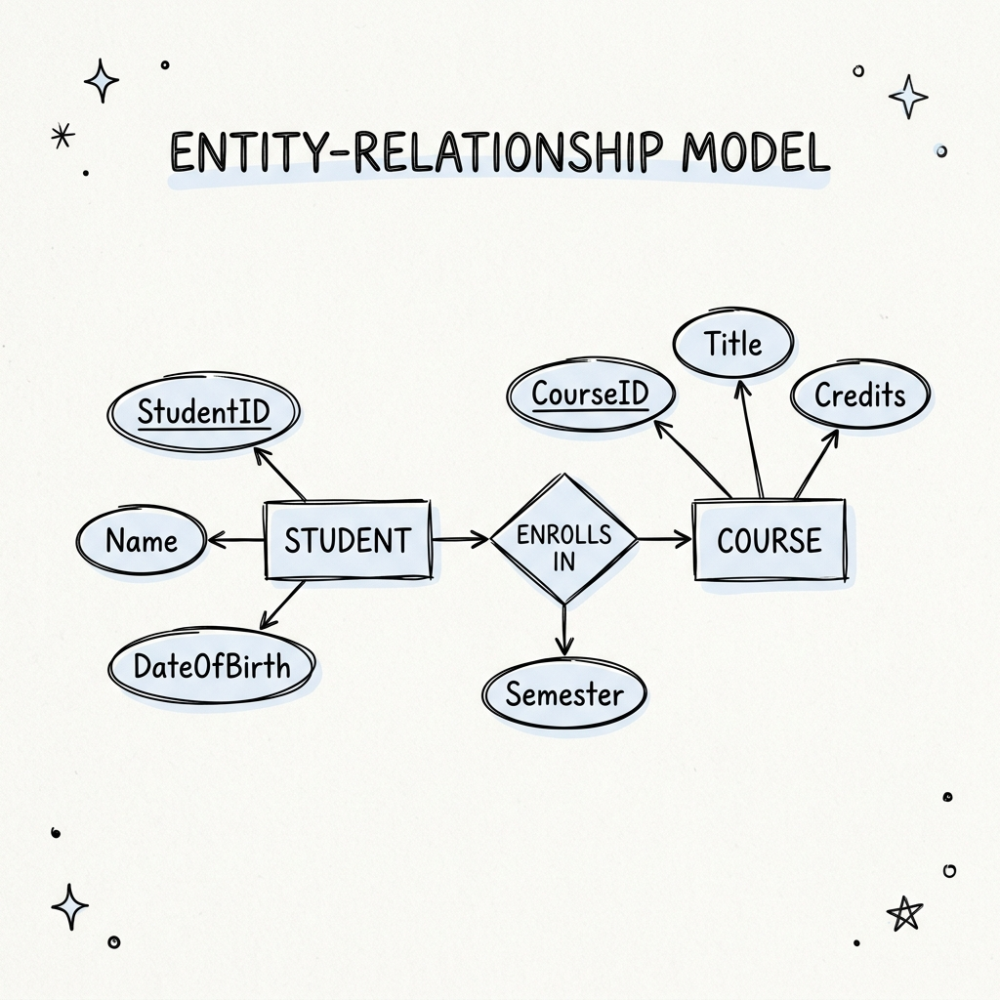
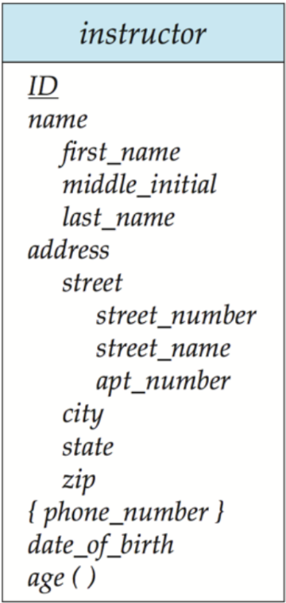
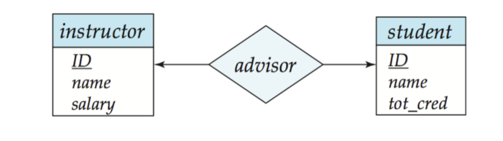
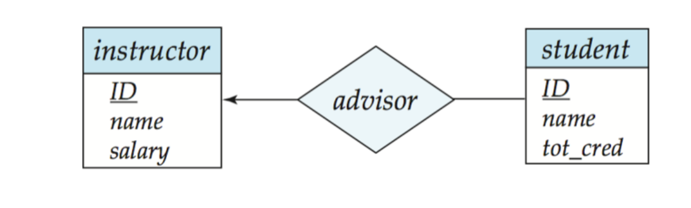
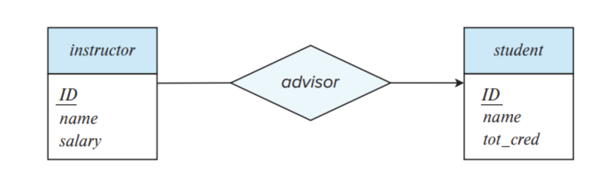
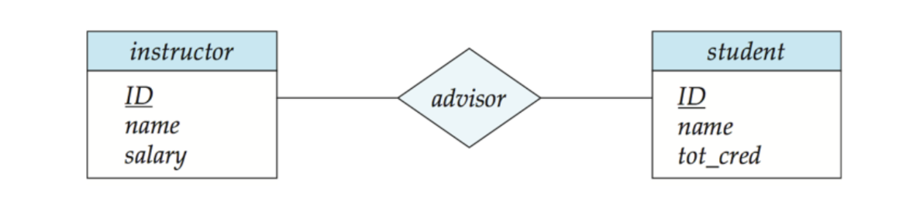
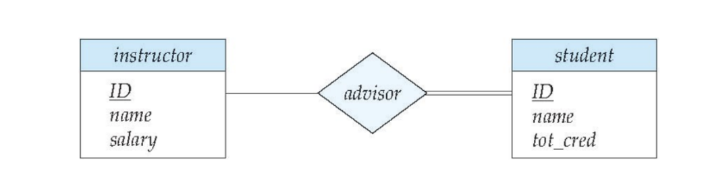
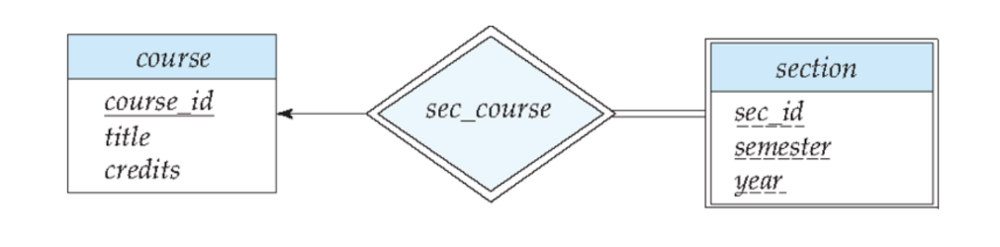

# Introduction to Entity Sets

The Entity-Relationship (ER) model is a high-level conceptual data model that helps in designing the schema of a database. It allows us to describe the data involved in a real-world enterprise in terms of objects and their relationships.

- **Entity**: An entity is an object that exists and is distinguishable from other objects. For example, a specific student named "Alice" is an entity.
- **Entity Set**: An entity set is a collection of entities of the same type that share the same properties or attributes. For example, the set of all students in a university forms an entity set.

## Strong Entity Set
- A strong entity set is an entity set that contains sufficient attributes to uniquely identify all its entities.
- A strong entity set always has a **Primary Key**.

## Weak Entity Set
- A weak entity set is an entity set that does not contain sufficient attributes to uniquely identify its entities on its own.
- A primary key does not exist for a weak entity set.
- Instead, it contains a partial key called a **Discriminator**. The discriminator is represented in an ER diagram by underlining the attribute with a **dashed line**.

### Characteristics of Weak Entity Sets
- A weak entity set cannot exist independently since it doesn't have a primary key. It depends on a strong entity set.
- It features in the model in relationship with a strong entity set. This dependency is called an **identifying relationship**.
- The primary key of a weak entity set is formed by combining its discriminator with the primary key of the strong entity set it depends on.
- **Primary key of weak entity set = Discriminator + Primary key of Strong entity set**.
- A weak entity set must have **total participation** in its identifying relationship.

---

# Attributes

An attribute is a property or characteristic associated with an entity set. For example, the `Student` entity set might have attributes like `Name`, `Age`, and `Roll Number`.

### Types of Attributes

- **Simple attribute**: An attribute that cannot be divided into smaller sub-parts (e.g., `Age`).
- **Composite attribute**: An attribute that can be divided into smaller sub-parts. For example, a `Name` attribute can be divided into `First Name`, `Middle Name`, and `Last Name`.
- **Single-valued attribute**: An attribute that holds a single value for a specific entity (e.g., `Roll Number`).
- **Multivalued attribute**: An attribute that can hold multiple values for a specific entity. For example, a student might have multiple phone numbers (`{phone_numbers}`).
- **Derived attribute**: An attribute whose value is calculated (derived) from the value of another attribute. For example, `Age()` can be derived from the `Date of Birth` attribute.

{width=50%}

---

# Entity-Relationship (ER) Diagrams

An ER diagram is a visual representation of the ER model. The standard notation involves:

- **Rectangles**: Represent entity sets.
- **Ellipses**: Attributes are listed inside ellipses and connected to the entity set.
- **Solid Underline**: Indicates a primary key attribute.
- **Diamonds**: Represent relationship sets.
- **Double Lines**: Indicate total participation of an entity in a relationship.
- **Double Rectangles**: Represent weak entity sets.
- **Double Diamonds**: Represent identifying relationship sets for weak entity sets.

---

# Mapping Cardinalities (Relationship Types)

Mapping cardinalities express the number of entities to which another entity can be associated via a relationship set.

## One-to-One (1:1) Relationship
- Each entity in $A$ is associated with at most one entity in $B$.
- Each entity in $B$ is associated with at most one entity in $A$.
- *Example*: Each instructor has at most one student, and each student has at most one instructor.

{width=70%}

## One-to-Many (1:N) Relationship
- Each entity in $A$ can be associated with one or many entities in $B$.
- Each entity in $B$ is associated with at most one entity in $A$.
- *Example*: An instructor can advise multiple students, but each student has only one instructor.

{width=70%}

## Many-to-One (N:1) Relationship
- Each entity in $A$ is associated with at most one entity in $B$.
- Each entity in $B$ can be associated with one or many entities in $A$.
- *Example*: Many students can be advised by the same instructor, but each student has at most one instructor.

{width=70%}

## Many-to-Many (M:N) Relationship
- Each entity in $A$ can be associated with one or many entities in $B$.
- Each entity in $B$ can be associated with one or many entities in $A$.
- *Example*: An instructor can advise multiple students, and a student can have multiple instructors.

{width=70%}

---

# Total and Partial Participation

Participation constraints dictate whether the existence of an entity depends on its being related to another entity via the relationship type.

- **Total Participation**: Every entity in the entity set must participate in at least one relationship in the relationship set. Indicated by a double line.
- **Partial Participation**: Some entities may not participate in any relationship in the relationship set. Indicated by a single line.

*Example*: If every student *must* have an instructor, the `Student` entity set has total participation. If an instructor *may or may not* have a student, the `Instructor` entity set has partial participation.

{width=80%}

---

# Expressing Weak Entity Sets in ER Diagrams

As discussed earlier, a weak entity set does not have a primary key and depends on a strong entity set. In an ER diagram, we denote the weak entity set with a double rectangle, its identifying relationship with a double diamond, and its discriminator attribute with a dashed underline.

{width=80%}
