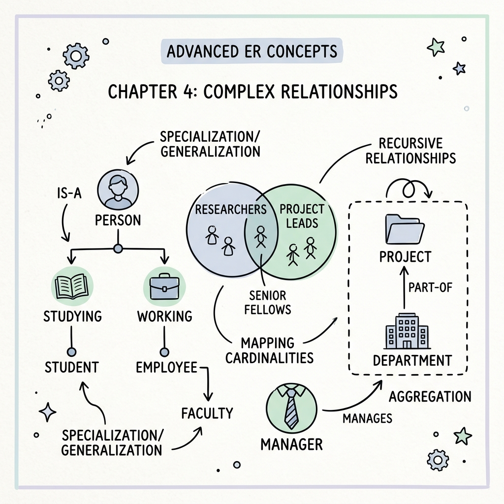
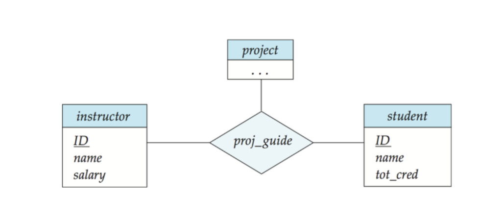
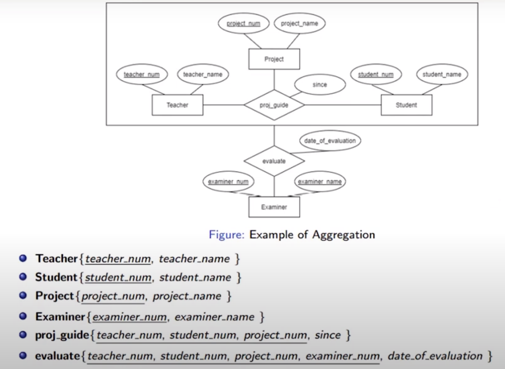
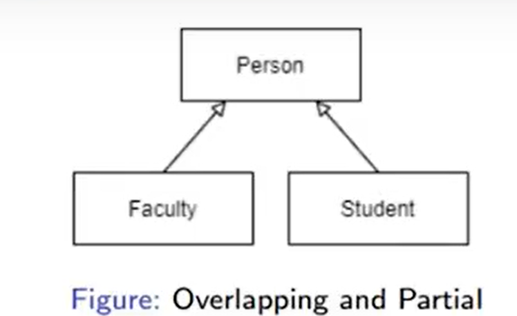
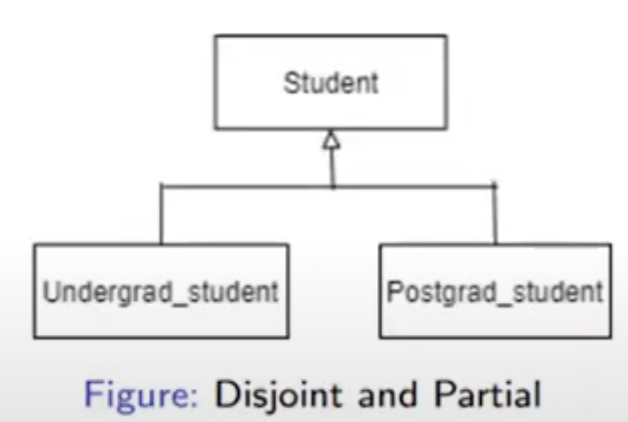
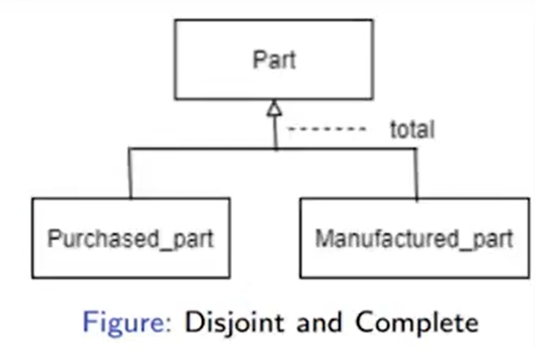
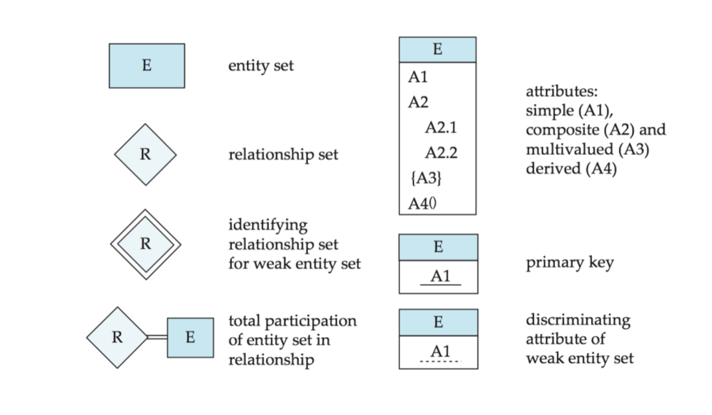

As databases grow in complexity, the standard Entity-Relationship model may not be sufficient to capture intricate real-world constraints and relationships. To address this, extended ER features are used.

# Ternary Relationships

A **Ternary Relationship** is a relationship that exists among three entity sets simultaneously. Instead of linking two entity sets (binary), a single diamond connects three rectangles.

*Example*: Consider a scenario where `Instructors` assign `Projects` to `Students`. This cannot be accurately captured by breaking it into binary relationships because a specific student is assigned a specific project by a specific instructor. Thus, the relationship involves all three entities at once.

{width=80%}

---

# Aggregation

**Aggregation** is an abstraction through which relationships are treated as higher-level entities. We use aggregation when we need to establish a relationship *with* another relationship.

*Why use Aggregation over Ternary Relationships?*
Sometimes, a ternary relationship doesn't clearly convey the natural hierarchy of the data. If a relationship inherently acts like an entity that participates in another relationship, aggregation is a better design choice.

*Example*: Suppose an `Instructor` and a `Student` have an `Advises` relationship. Now, suppose a `Project` is assigned to that specific `(Instructor, Student)` pair. Instead of making a ternary relationship, we draw a box around the `Advises` relationship (aggregating it into a higher-level entity) and connect it to the `Project` entity via an `Assigned` relationship.

{width=80%}

---

# Extended ER Features: Specialization and Generalization

Specialization is the process of defining a set of subclasses from an entity set (top-down approach). Generalization is the reverse process of combining subclasses into a higher-level superclass (bottom-up approach).

When dealing with class hierarchies, we must define constraints on how entities can participate in the subclasses. These constraints are categorized by **disjointness** and **completeness**.

## Disjointness Constraints

- **Disjoint**: An entity can belong to *at most one* lower-level entity set (subclass).
- **Overlapping**: An entity can belong to *more than one* lower-level entity set simultaneously.

## Completeness Constraints

- **Complete (Total)**: Every entity in the higher-level entity set (superclass) *must* belong to at least one lower-level entity set.
- **Partial**: Some entities in the higher-level entity set *might not* belong to any lower-level entity set.

Let's look at the combinations of these constraints:

### 1. Overlapping and Partial

- **Overlapping**: An entity can belong to multiple subclasses.
- **Partial**: An entity does not have to belong to any subclass.

*Example*: A `Person` can be a `Student`, a `Faculty` member, or **both** (Overlapping). Also, there may be persons (like staff or guests) who are **neither** students nor faculty (Partial).

{width=80%}

### 2. Disjoint and Partial

- **Disjoint**: An entity can belong to at most one subclass.
- **Partial**: An entity does not have to belong to any subclass.

*Example*: A `Student` can be either an `UG_Student` (Undergraduate) or a `PG_Student` (Postgraduate), but they **cannot be both** at the same time (Disjoint). Furthermore, there might be some students (e.g., diploma or visiting students) who are **neither** UG nor PG students (Partial).

{width=80%}

### 3. Disjoint and Complete

- **Disjoint**: An entity can belong to at most one subclass.
- **Complete**: Every entity must belong to a subclass.

*Example*: Every physical `Part` in a factory **must** be classified as either a `Purchased_Part` or a `Manufactured_Part` (Complete). A part **cannot** be both purchased and manufactured simultaneously (Disjoint).

{width=80%}

*(Note: The fourth combination, Overlapping and Complete, implies an entity must belong to at least one subclass and can belong to multiple. It is less common but conceptually possible.)*

---

# Summary

The concepts covered in the Entity-Relationship model can be summarized below. ER diagrams provide a standard language to communicate database schemas between developers, designers, and stakeholders.

