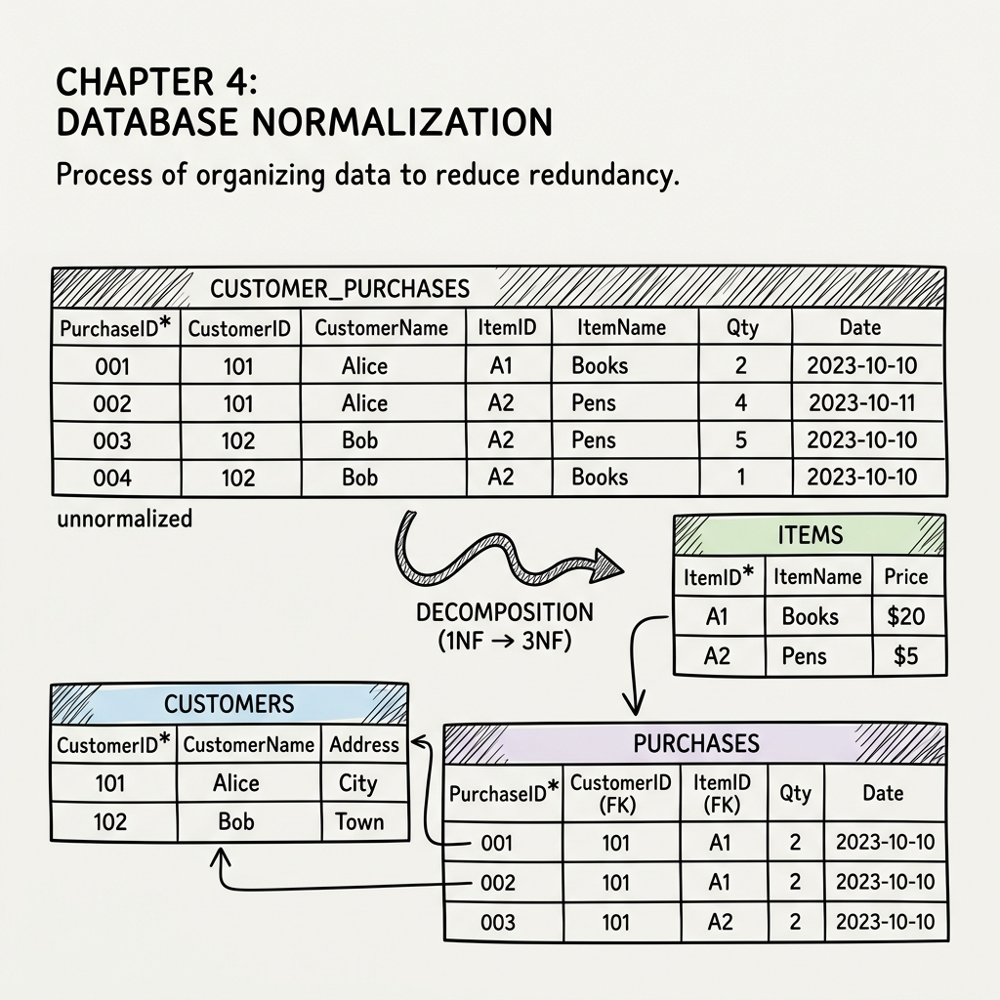

# What is Normalization?

**Normalization** (or Schema Refinement) is a systematic technique of organizing data in a database. It involves decomposing a large, poorly-structured table into smaller, well-structured tables.

Normalization serves two primary purposes:

1. **Eliminating Redundant (useless) Data**: Ensuring that the same piece of information isn't stored in multiple places.

2. **Ensuring Data Dependencies**: Ensuring that data is logically stored and related correctly.

---

# Why Normalize? The Data Anomalies

If a database is not normalized, it can suffer from three major types of **Anomalies** (errors or inconsistencies) when data is modified. 

Imagine a single unnormalized table storing both student details and the courses they are enrolled in: `Student_Course(StudentID, StudentName, CourseID, CourseName)`.

### 1. Insertion Anomaly
An insertion anomaly occurs when you cannot insert certain data into the database without the presence of other unrelated data.

* **Example**: If a new course is created but no students have enrolled in it yet, you cannot add the course to the `Student_Course` table because you would have to leave the `StudentID` (part of the primary key) blank.

### 2. Deletion Anomaly
A deletion anomaly occurs when deleting a row inadvertently causes the loss of other unrelated information.

* **Example**: If a student is the only person enrolled in "Advanced Databases", and that student drops out, deleting their record will also completely erase the existence of the "Advanced Databases" course from the system.

### 3. Update Anomaly
An update anomaly occurs when a piece of data is stored in multiple rows, and updating it requires changing multiple records. If one record is missed, the database becomes inconsistent.

* **Example**: If "Alice" gets married and changes her name, you must update her `StudentName` in every single row for every course she takes. If you miss one, the database will show two different names for the same `StudentID`.

---

# Key Prerequisites

Before diving into Normal Forms, we must define the mathematical rules that govern how attributes relate to one another.

## Functional Dependencies (FDs)
A Functional Dependency, denoted as $X \rightarrow Y$, means that the attribute(s) $X$ uniquely determines the attribute(s) $Y$. 
If you know the value of $X$, you can look up exactly one corresponding value of $Y$.

* **Example**: $StudentID \rightarrow StudentName$. If you know the ID, there is only one possible name associated with it. Here, $X$ is called the **Determinant**.

## Database Keys
- **Superkey**: A set of one or more attributes that can uniquely identify a row in a table. If $\{StudentID\}$ is a superkey, then $\{StudentID, StudentName\}$ is also a superkey.
- **Candidate Key**: A *minimal* superkey. It is a superkey where no proper subset of its attributes can uniquely identify a row. There can be multiple candidate keys in a table.
- **Primary Key**: The specific candidate key chosen by the database designer to uniquely identify rows.

## Attribute Types
Based on the Candidate Keys, all attributes in a table are divided into two categories:

- **Prime Attribute**: An attribute that is a part of *any* candidate key.

- **Non-Prime Attribute**: An attribute that is *not* a part of any candidate key.
