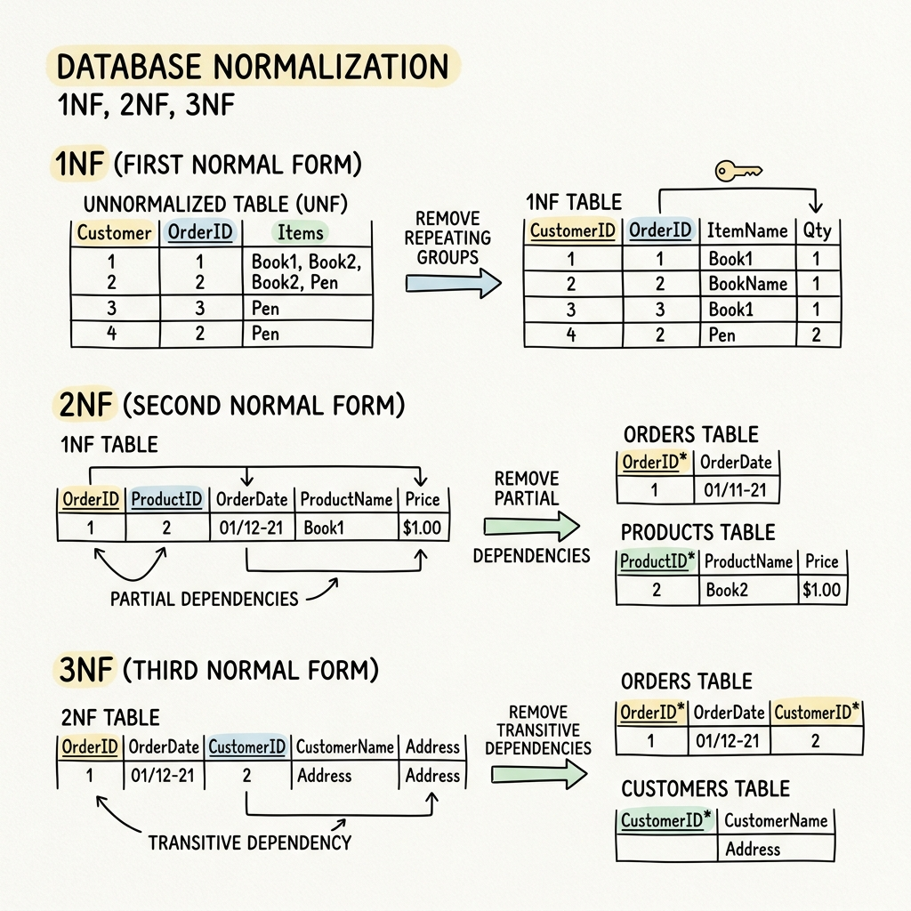

A **Normal Form** specifies a set of conditions that a relational schema must satisfy in terms of its constraints. As we move from 1NF up to higher normal forms, the rules become stricter, and data redundancy is further reduced.

---

# 1NF (First Normal Form)

A relation is in First Normal Form (1NF) if and only if it satisfies the following rules:

1. **Atomic Values**: All domains should only have atomic (indivisible) values.

2. **No Multivalued Attributes**: Each cell of the table must hold a single value.

### **Example: Failing 1NF**

Consider a table storing student courses:

| SID | Sname | Cname |
| --- | ----- | ----- |
| S1  | A     | C, C++ |
| S2  | B     | C++, DB |
| S3  | C     | DB |

- The `Cname` column contains multiple values for S1 ("C", "C++") and S2 ("C++", "DB").
- Because *Cname* is a multivalued attribute, the above table is **not** in 1NF. 
- To convert this to 1NF, we would create separate rows for each course a student takes.

---

# 2NF (Second Normal Form)

A relation $R$ is in Second Normal Form (2NF) only if:

1. It is already in **1NF**.

2. It contains **no Partial Dependency**.

### **Understanding Partial Dependency**
A dependency $A \rightarrow B$ is a partial dependency only if:

- $A$ is a **proper subset of a Candidate Key**.

- $B$ is a **Non-Prime Attribute** (an attribute not part of any candidate key).

In simple terms: *No non-prime attribute should depend on just a part of a composite candidate key.* If a table has a single-attribute candidate key (and it's the only key), it is automatically in 2NF.

## **2NF Solved Example**

Consider a relation $R(A, B, C, D, E, F)$ and its Functional Dependencies:
$$FD=\{AB \rightarrow CDE, \space E \rightarrow F, \space BF \rightarrow A, \space C \rightarrow B\}$$

**Step 1: Find the Candidate Keys**
Let's find the closures of attribute sets to see which ones determine all attributes in $R$.

- $(AB)^+ = \{A, B, C, D, E, F\}$

- Since $C \rightarrow B$, we can substitute $B$ with $C$: $(AC)^+ = \{A, C, B, D, E, F\}$

- Since $BF \rightarrow A$, if we have $B$ and $F$, we get $A$. Thus $(BF)^+ = \{B, F, A, C, D, E\}$

Our **Candidate Keys** are: $\{A, B\}, \{A, C\}, \{B, F\}$.

**Step 2: Identify Prime and Non-Prime Attributes**

- **Prime Attributes**: $A, B, C, F$ (since they appear in at least one candidate key).

- **Non-Prime Attributes**: $D, E$.

**Step 3: Check for Partial Dependencies**
We need to check if any non-prime attribute ($D$ or $E$) depends on a *proper subset* of a candidate key. The proper subsets of our candidate keys are $\{A\}, \{B\}, \{C\}, \{F\}$.

- Do we have $A \rightarrow D$ or $A \rightarrow E$? No.

- Do we have $B \rightarrow D$ or $B \rightarrow E$? No.

- Do we have $C \rightarrow D$ or $C \rightarrow E$? No ($C$ only determines $B$, which is a prime attribute).

- Do we have $F \rightarrow D$ or $F \rightarrow E$? No.

Since no non-prime attribute depends on a part of a candidate key, there is **no partial dependency**.
**Conclusion**: Relation $R$ **is in 2NF**.

---

# 3NF (Third Normal Form)

A relational schema $R$ is in 3NF if, for every functional dependency $A \rightarrow B$ associated with $R$, **at least one** of the following conditions is true:

1. $B \subseteq A$ (It is a trivial FD).

2. $A$ is a **superkey** of $R$.

3. $B$ is a **prime attribute** of $R$.

In simple terms: *3NF prohibits transitive dependencies where a non-prime attribute determines another non-prime attribute.*

### **Note:**
- 3NF guarantees both **dependency preservation** and **lossless join decomposition**.

## **3NF Solved Example**

Let's use the same relation $R(A, B, C, D, E, F)$ with $FD=\{AB \rightarrow CDE, \space E \rightarrow F, \space BF \rightarrow A, \space C \rightarrow B\}$.
We know it is in 2NF. We know the Candidate Keys are $\{A, B\}, \{A, C\}, \{B, F\}$, and Prime Attributes are $A, B, C, F$.

Let's check each FD against the 3NF rules:

- **$AB \rightarrow CDE$**: $AB$ is a superkey. (Condition 2 holds - Passes).

- **$E \rightarrow F$**: $E$ is *not* a superkey. However, $F$ is a prime attribute! (Condition 3 holds - Passes).

- **$BF \rightarrow A$**: $BF$ is a superkey. (Condition 2 holds - Passes).

- **$C \rightarrow B$**: $C$ is *not* a superkey. However, $B$ is a prime attribute! (Condition 3 holds - Passes).

**Conclusion**: Since every functional dependency satisfies at least one of the 3NF conditions, the relation $R$ **is in 3NF**.
