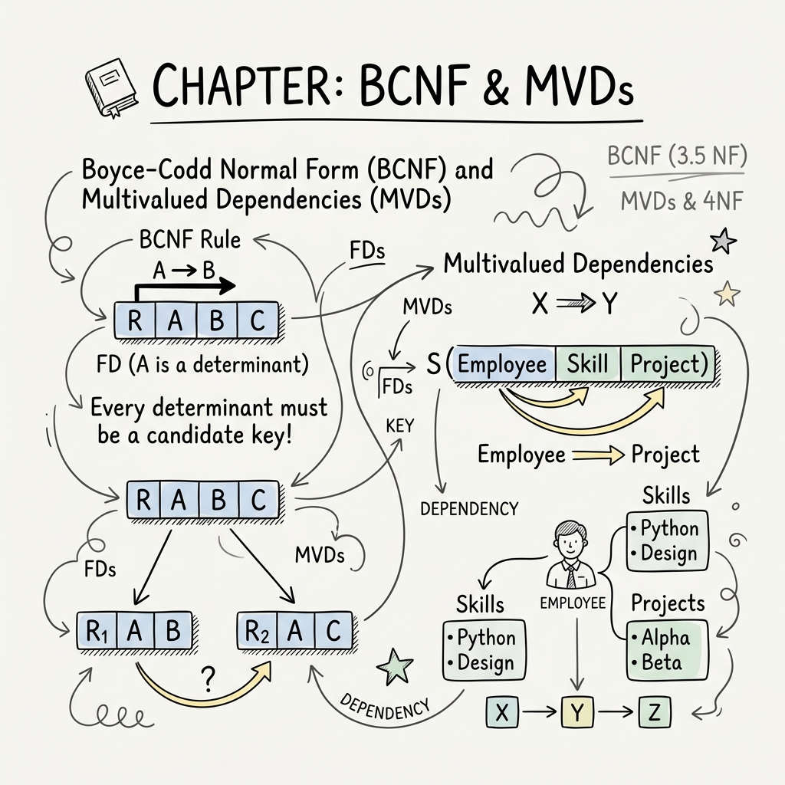

While 3NF is sufficient for most practical database designs, it still allows certain types of anomalies if there are overlapping candidate keys. Boyce-Codd Normal Form (BCNF) was introduced to handle these edge cases by applying a stricter rule.

---

# BCNF (Boyce-Codd Normal Form)

A relational schema $R$ is in BCNF if for every non-trivial functional dependency $A \rightarrow B$ associated with $R$, the following condition holds:
- **$A$ must be a superkey**.

*Simply put: The left side of every functional dependency must uniquely identify the entire row. The "prime attribute" loophole present in 3NF is removed.*

### **Note:**
- BCNF decomposition is always **lossless**.
- BCNF decomposition **may or may not be dependency preserving**.

## **BCNF Solved Example 1: Success**

Consider $R(A, B, C, D)$ and its $FD=\{A \rightarrow B, \space B \rightarrow C, \space C \rightarrow D, \space D \rightarrow A\}$

**Step 1: Find Candidate Keys**

- $A^+ = \{A, B, C, D\}$
- $B^+ = \{B, C, D, A\}$
- $C^+ = \{C, D, A, B\}$
- $D^+ = \{D, A, B, C\}$
Every single attribute is a candidate key (and thus, a superkey).

**Step 2: Check BCNF Condition**

- For $A \rightarrow B$, $A$ is a superkey.
- For $B \rightarrow C$, $B$ is a superkey.
- For $C \rightarrow D$, $C$ is a superkey.
- For $D \rightarrow A$, $D$ is a superkey.

**Conclusion:** All functional dependencies satisfy the BCNF condition. The relation **is in BCNF**.

## **BCNF Solved Example 2: Failure**

Let's look back at the example from the 3NF chapter: 
$R(A, B, C, D, E, F)$ with $FD=\{AB \rightarrow CDE, \space E \rightarrow F, \space BF \rightarrow A, \space C \rightarrow B\}$.
We found the candidate keys were $\{A, B\}, \{A, C\}, \{B, F\}$.

Now let's check the FDs against the strict BCNF rule:

- $E \rightarrow F$: Is $E$ a superkey? **No.**
- $C \rightarrow B$: Is $C$ a superkey? **No.**

**Conclusion:** Because $E$ and $C$ are not superkeys, the relation **fails BCNF**, even though it was successfully in 3NF!

---

# Multivalued Dependency (MVD)

As we move beyond BCNF, we encounter anomalies caused by independent multivalued facts about an entity. This introduces the concept of Multivalued Dependency, denoted as $\twoheadrightarrow$.

Let $R$ be a relation schema. The multivalued dependency $X \twoheadrightarrow Y$ holds if, for a single value of $X$, there is a set of values for $Y$ that are completely independent of the other attributes in the table.

For an MVD to exist:

- The total number of attributes in the table should be more than two.
- If there are exactly 3 attributes ($X, Y, Z$), then $Y$ and $Z$ must be independent of each other, but both depend on $X$.

## **Visualizing MVD**

In this example, an instructor teaches a course, and a course has recommended books. 

- The instructors for a course are completely independent of the books for a course.
- Thus, `course_name` $\twoheadrightarrow$ `instructor`
- And `course_name` $\twoheadrightarrow$ `{book, edition}`

If you try to store this in a single table, you must repeat every instructor for every book, causing massive data redundancy!

## **Trivial MVD**
An MVD $X \twoheadrightarrow Y$ is considered **trivial** if:

- $Y$ is a subset of $X$ ($Y \subseteq X$)
- Or, $X \cup Y = R$ (the entire table)

---

# MVD Theory Rules

MVDs follow a set of inference rules, similar to regular functional dependencies:

| Name | Rule |
| ---- | ---- |
| Complementation | If $X \twoheadrightarrow Y$, then $X \twoheadrightarrow (R − (X \cup Y))$ |
| Augmentation | If $X \twoheadrightarrow Y$ and $W \supseteq Z$, then $WX \twoheadrightarrow YZ$ |
| Transitivity | If $X \twoheadrightarrow Y$ and $Y \twoheadrightarrow Z$, then $X \twoheadrightarrow (Z−Y)$|
| Replication | If $X \rightarrow Y$, then $X \twoheadrightarrow Y$ (but the reverse is not true) |
| Coalescence | If $X \twoheadrightarrow Y$ and there is a $W$ such that $W \cap Y$ is empty, $W \rightarrow Z$, and $Z \subseteq Y$, then $X \rightarrow Z$ |

---

# 4NF (Fourth Normal Form)

To resolve the redundancies caused by Multivalued Dependencies, we use the Fourth Normal Form.

A relation schema $R$ is in 4NF if and only if the following conditions are satisfied:

1. $R$ is already in **BCNF**.
2. It does not contain any **non-trivial multi-valued dependencies**.

If a table violates 4NF due to $X \twoheadrightarrow Y$, we fix it by decomposing the table into two separate tables: one holding $(X, Y)$ and the other holding $(X, \text{everything else})$.
