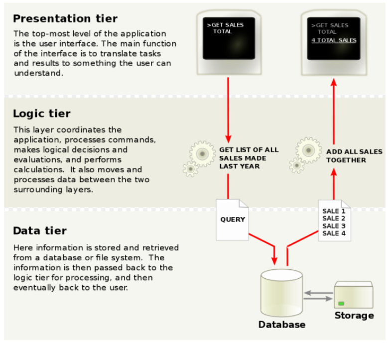

## Application Programs

Databases don't exist in isolation, they always live inside an **application** that users interact with. Database-backed applications show up in almost every corner of modern life, for example, travel, communication, education etc.
Despite looking completely different, most are built the same way underneath — they all use an RDBMS and they are all split into three layers.

---

## The Three-Layer Architecture

Think of it like a restaurant : the waiter takes your order (Presentation), the chef decides how to prepare it (Business Logic), and the pantry stores all the ingredients (Data Access). Each role is distinct, and each has its own concerns.



### Presentation Layer (Frontend)
This is everything the user actually sees and touches. It collects input and displays results. Within the presentation layer, the most widely used design pattern is **Model-View-Controller (MVC)**:

| Component | Role |
|---|---|
| **Model** | Represents business data and rules |
| **View** | Displays data to the user (depends on device/format) |
| **Controller** | Receives user events, invokes model actions, selects the view to return |

### Business Logic Layer (Middle Layer / Tier 2)

Implements the core functionalities, workflows, and rules of the application (such as authentication, search logic, pricing, payment gateways, and order management). It acts as the bridge that connects the frontend and backend layers.

> ⚠️ The middle layer hides the database schema from the frontend. The frontend never needs to know which table a piece of data lives in.

### Data Access Layer (Backend / Tier 3)

Manages persistent data. It is responsible for handling large volumes of information, ensuring high-speed access, maintaining data security, and interfacing directly with the database system .

---

## Architecture Classification

| Tier | What it looks like |
|---|---|
| **1-Tier** | All components (user interface, middleware, and backend database) reside on a single server or platform. This is the simplest and most direct setup |
| **2-Tier** | A classic client-server model where the client directly communicates with the database server with no intermediate application logic server.|
| **3-Tier** | Presentation, Business Logic, and Data Access are separated into three independent layers. This is the de-facto standard for DBMS design. |
| **n-Tier** | Extends 3-tier by distributing components across many servers with load balancers, caches, and microservices |

---

## Web Applications and Scripting

### The World Wide Web

The Web is a massive collection of **hypertext documents** (HTML pages) spread across servers worldwide, all linked to each other. HTML can contain text, images, hyperlinks, and forms — input fields that let users send data back to a server, which is the bridge between the user and the database.

---

### URLs, URIs, and URNs

Every resource on the web needs an address. A URL like `http://www.acm.org/sigmod` has three parts:

```
http  ://  www.acm.org  /sigmod
 ↑              ↑           ↑
Protocol    Machine name   Document path
```

- **URI** — An umbrella term that covers both locators (URLs) and names (URNs).
- **URL** — Specifies how to retrieve a resource and where it is located, functioning like a person's  *street address*.
- **URN** — Serves as a unique identifier for a resource, functioning like a person's  *name*. It defines the identity of a resource but does not specify its location 

---

### HTML and HTTP

- **HTML (Hypertext Markup Language)** : Used to format content, embed links, display tables, and gather user input through interactive forms (including dropdown menus, text boxes, and buttons).
- **HTTP (Hypertext Transfer Protocol)** : The primary communication protocol used between web clients and web servers .
The key thing to know: HTTP is **connectionless** — once the server replies, it immediately forgets the conversation ever happened. Every new request is treated as brand new. This keeps server load manageable (imagine maintaining open connections with millions of users at once).

---

### Sessions and Cookies

HTTP being connectionless creates a problem — how does a website remember you're logged in as you move between pages?

The answer is **cookies**. Here's how it works:

1. On your first visit, the server sends a small identifying token (cookie) to your browser
2. Your browser stores it and automatically attaches it to every subsequent request
3. The server reads it, looks it up, and knows exactly who you are

This is how Amazon keeps your cart alive across sessions. Cookies can be **permanent** (survive browser restarts) or **session-only** (deleted when you close the tab).

---

## Scripting

A **script** is a set of commands embedded in a web page or on the server, executed at runtime. Scripts are what make pages dynamic. Two types:

###  Client-Side Scripting
Client-side scripts are downloaded directly to the client's computer and run locally inside the web browser.

- **Primary Languages** : JavaScript, VBScript.
- **Purpose** : Handles immediate user interactions, validates form inputs locally, and updates page visuals without triggering a full page reload (e.g., AJAX technology).
- **Security Context** : To prevent malicious scripts from accessing local hard drives, client-side scripts are executed in a heavily restricted  **safe-mode sandbox**  that prevents direct system calls or unauthorized file operations.

###  **Server-Side Scripting**
Server-side scripts are executed entirely on the web server before the final HTML is generated and sent back to the client.

- **Primary Languages** : PHP, JSP, ASP, Python, Perl.
- **Purpose** : Simplifies database integration. Developers embed executable logic or database queries directly within HTML files. The server runs these queries, dynamically inserts the results into the HTML, and returns the finished static webpage to the user.
- **Security Context** : Safe and secure. The client never sees the server's proprietary code or database connection details—only the final, clean HTML output.

---

### Servlets

A **Java Servlet** is a Java program that lives on a web/application server and handles HTTP requests. The flow:

```
User submits form
    → HTTP request hits the server
    → Server loads the Servlet
    → Servlet reads parameters, runs SQL via JDBC
    → Servlet writes HTML response
    → Thread closes
```

Each request gets its own **thread**, so many users can be served simultaneously.

**Session handling** in Servlets uses cookies automatically:
```java
request.getSession(true);                      // create session
session.setAttribute("userid", "alice");       // store data
session.getAttribute("userid");                // retrieve later
```

Servlets run inside application servers like **Apache Tomcat**, GlassFish, or JBoss.

---

### JSP (Java Server Pages)

Writing HTML entirely through `out.println()` in a Servlet is painful. JSP lets you write HTML normally and drop Java logic inside `<% ... %>` tags wherever needed:

```html
<body>
  <% if (request.getParameter("name") == null) { %>
    Hello, World!
  <% } else { %>
    Hello, <%= request.getParameter("name") %>!
  <% } %>
</body>
```

The server compiles a JSP page into a Servlet the first time it's requested, so performance is identical — JSP is just much easier to write and maintain.


---

### PHP

PHP works exactly like JSP — embed logic inside HTML, server executes it, client gets plain HTML. It has extensive database libraries (ODBC) and was the dominant language for web development for many years.

```html
<body>
  <?php
    if (!isset($_REQUEST['name'])) { echo "Hello World"; }
    else { echo "Hello, " . $_REQUEST['name']; }
  ?>
</body>
```

PHP and JSP are conceptually the same. The choice between them comes down to the tech stack being used.