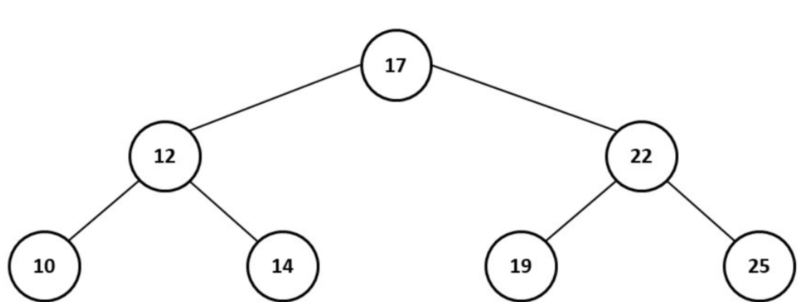

## Algorithms and Complexity Analysis

### Basics and Definitions
- **Algorithm vs. Program:** An **algorithm** is a finite sequence of well-defined, computer-implementable instructions to solve a class of problems or to perform a computation. Crucially, an algorithm **must terminate**. A **program**, such as an operating system, is an implementation that may run indefinitely without terminating.

### Motivation for Analysis
Why do we analyze algorithms? 
- To **predict performance** (how fast will this run on a billion rows?).
- To **avoid bugs** and **provide guarantees** on execution boundaries.
- To understand the theoretical limits of computational problems.

### Factors of Analysis
When we analyze an algorithm, we measure the "cost" based on several factors:

1. **Time Complexity:** How long does it take to execute?

2. **Space/Storage Complexity:** How much memory (RAM) does it consume?

3. **Other factors:** Power consumption and network bandwidth (especially relevant in cloud databases).

### Methodologies
- **Counting Model:** A simplified theoretical model (Random-Access Machine) where we sum the cost and frequency of primitive operations (like addition, assignment, etc.).
- **Asymptotic Analysis:** We use **Big-Oh ($O$) notation** to measure the growth of resource requirements as the input size ($n$) increases toward infinity. We typically focus on the **Worst case** and **Average case** scenarios.

#### Complexity Classes
From fastest (best) to slowest (worst):

1. **$O(1)$** - Constant Time

2. **$O(\log n)$** - Logarithmic Time

3. **$O(n)$** - Linear Time

4. **$O(n \log n)$** - Linearithmic Time

5. **$O(n^2)$** - Quadratic Time

6. **$O(n^3)$** - Cubic Time

7. **$O(2^n)$** - Exponential Time

---

## Data Structures

A **Data Structure** is a specialized format for organizing, processing, retrieving and storing data in memory.
Standard operations on any data structure include: **Create, Insert, Delete, Find (Search), Update, and Close.**

### Linear Data Structures

1. **Arrays:** Contiguous blocks of memory. 
   - *Advantage:* Extremely fast indexed/random access ($O(1)$).
   - *Disadvantage:* Very slow insertion/deletion ($O(n)$) because all subsequent elements must be shifted.
2. **Linked Lists:** Elements are stored in nodes that contain pointers to the next node.
   - *Advantage:* Very fast insertion/deletion ($O(1)$ if you are already at the position).
   - *Disadvantage:* Slow sequential access ($O(n)$) since you must traverse from the head.
3. **Queues:** Follow First-In-First-Out (FIFO) logic (like a line at a grocery store).
4. **Stacks:** Follow Last-In-First-Out (LIFO) logic (like a stack of plates).

---

## Non-Linear Data Structures: Trees

Unlike arrays or linked lists, a tree is a hierarchical data structure. They are absolutely critical for database indexing.

{width="70%"}

Let's break down the terminology:

- **Root:** The topmost node.

- **Parent/Child:** A node connected to nodes directly below it is a parent.

- **Leaf Nodes:** Nodes with no children.

- **Arity (or Degree):** The number of children a specific node has.

- **Level / Depth:** The distance from the root.

- **Height:** The maximum level in the tree.

### Binary Search Trees (BST)

A **Binary Search Tree** maintains a strict ordering property. For every node, all values in the **left subtree** are strictly *less* than the node's value, and all values in the **right subtree** are *greater*.

Let's build a BST from the data: `17, 22, 12, 10, 14, 25, 19`.

1. **Insert 17:** This is our first number, so it becomes the **Root**.
2. **Insert 22:** We compare 22 with 17. Since $22 > 17$, it goes to the **right**.
3. **Insert 12:** Compare 12 with 17. Since $12 < 17$, it goes to the **left**.
4. **Insert 10:** Compare 10 with 17 (left), then compare with 12. Since $10 < 12$, it goes to the **left** of 12.
... and so on.

The final result is the beautiful structure shown below!

{width="60%"}

If the tree remains balanced, this property allows us to search, insert, and delete in **$O(\log n)$** time, making it immensely faster than scanning an array.

---

## Search and Sorting

- **Linear Search:** Sequential checking of every element. Complexity is $O(n)$.
- **Binary Search:** An extremely efficient search on **sorted arrays** (or Binary Search Trees). At each step, it halves the search space. Complexity is $O(\log n)$.
- **Sorting Algorithms:** Common algorithms to organize data include Quicksort ($O(n \log n)$), Mergesort ($O(n \log n)$), Heap Sort ($O(n \log n)$), and the much slower Insertion Sort ($O(n^2)$).
