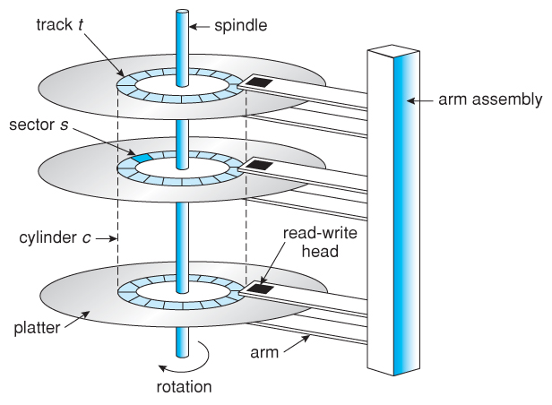
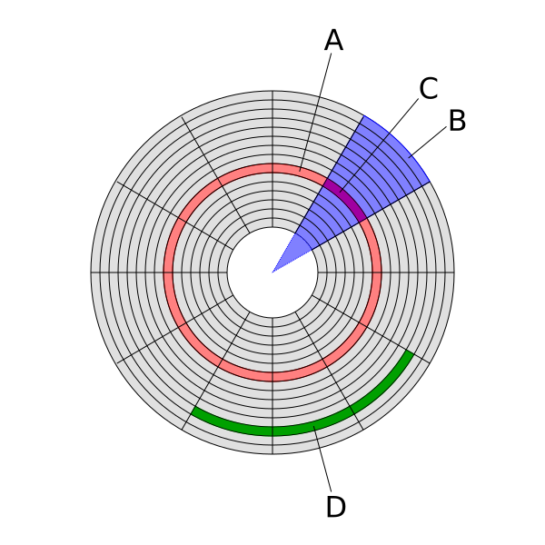

## Physical Storage Media

Data needs a place to live! Depending on how fast we need to access the data and how long we want it to survive without power, we use different types of storage media.

There is a fundamental divide in storage media: **Volatile** vs. **Non-Volatile**.

- **Volatile Storage:** Loses all data when the power is interrupted (e.g., Cache Memory, Main Memory / RAM). Extremely fast but temporary.
- **Non-Volatile Storage:** Retains data regardless of power status (e.g., Flash memory, Magnetic Disks, Optical Disks, Magnetic Tapes). Slower, but permanent.

### The Storage Hierarchy Pyramid

In computer architecture, we make trade-offs. If you want **speed**, it costs more and you get **less capacity**. If you want **capacity**, it costs less per gigabyte, but you sacrifice **speed**.

```{mermaid}
%%| fig-align: center
graph TD
    classDef volatile fill:#f9d0c4,stroke:#333,stroke-width:2px;
    classDef nonvolatile fill:#d4edda,stroke:#333,stroke-width:2px;

    subgraph Speed_vs_Capacity [ ]
    direction BT
    L1[Registers]:::volatile
    L2[Cache]:::volatile
    L3[Main Memory / RAM]:::volatile
    L4[Flash Memory / SSD]:::nonvolatile
    L5[Magnetic Disks / HDD]:::nonvolatile
    L6[Magnetic Tapes / Optical Disks]:::nonvolatile
    
    L6 --> L5 --> L4 --> L3 --> L2 --> L1
    end
```
*Note: As you move UP the pyramid, Speed and Cost per bit INCREASES. As you move DOWN the pyramid, Capacity and Access Time INCREASES.*

---

## Inside a Magnetic Disk (HDD)

To understand database performance, we must look at the physical mechanics of where our data actually lives: **Magnetic Disks**.

{width="50%"}

Think of a hard drive like an old-school vinyl record player:

- **Platter (The Record):** The circular disk coated with magnetic material.

- **Spindle (The Turntable Motor):** The central rod that spins the platters at high speeds (e.g., 7200 RPM).

- **Read/Write Head (The Needle):** The tiny magnet that hovers above the platter.

- **Actuator Arm (The Tonearm):** The mechanical arm that moves the Read/Write head.

### Data Organization on the Disk

{width="50%"}

- **(A) Track:** A single, concentric circular ring on the surface of the platter.
- **(C) Sector:** A track is divided into smaller arcs called sectors. It is the **smallest unit of data** that can be read or written (traditionally 512 bytes).
- **Cylinder:** The set of all tracks that are at the exact same position across all stacked platters.
- **(D) Block / Cluster:** A grouping of contiguous sectors used by the operating system to allocate space efficiently.

---

## Disk Performance Metrics

When a database asks the hard drive for a piece of data, the mechanical parts have to move.

### 1. Access Time
The total time it takes to begin reading the actual data.
$$Access \ Time = Seek \ Time + Rotational \ Latency$$

- **Seek Time:** The time taken to physically reposition the arm over the correct track.
- **Rotational Latency:** The time spent waiting for the correct sector to rotate directly underneath the head.

### 2. Data Transfer Rate
The speed at which data is moved from the disk to the main memory once the head is in position.

### 3. Reliability (MTTF)
Hard drives are mechanical, which means they will eventually break. Reliability is measured by **Mean Time To Failure (MTTF)**. An MTTF of 5 years doesn't mean it will break in exactly 5 years, but it provides a statistical average of expected lifespan.

---

## Emerging Technologies

While Magnetic Disks are still widely used, new technologies are constantly evolving storage:

- **Solid State Drives (SSD):** Use flash memory to store data persistently without any moving parts, significantly reducing Access Time.

- **Cloud Storage:** Abstracting the physical hardware entirely, relying on distributed remote servers.

- **DNA Digital Storage:** A futuristic approach using synthetic DNA to store massive amounts of data with extreme longevity.

- **Quantum Memory:** Theoretical storage systems leveraging quantum states for unprecedented speeds and security.
