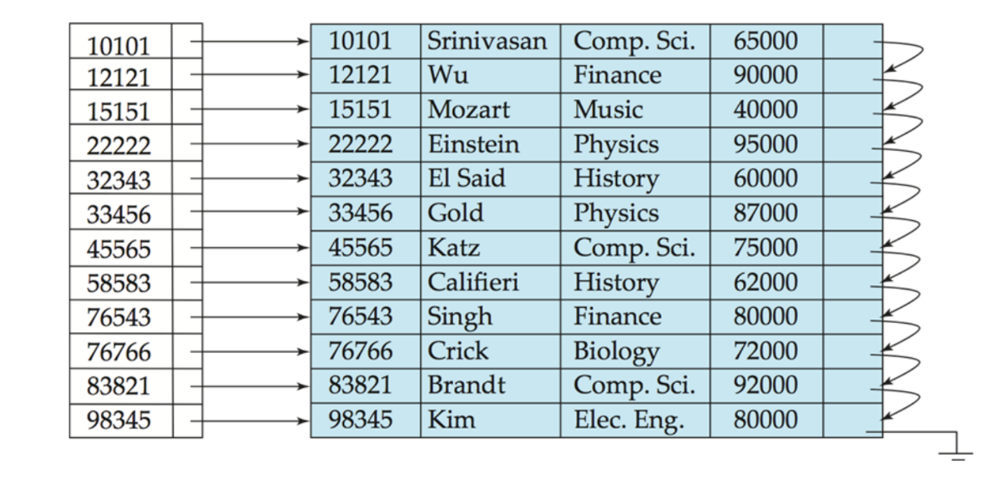
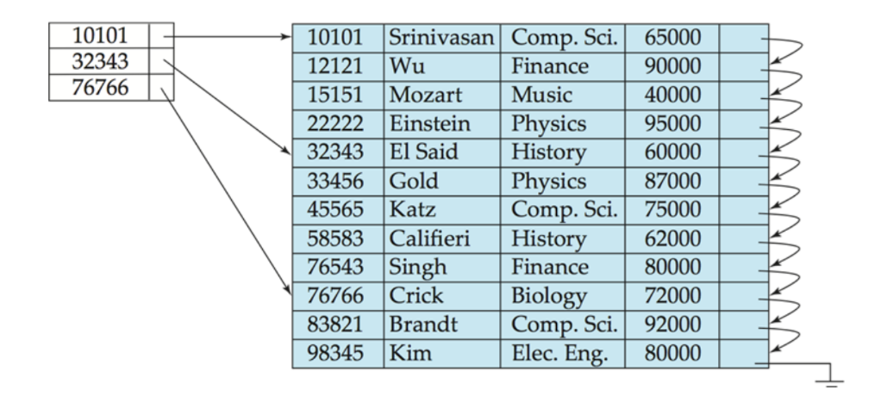
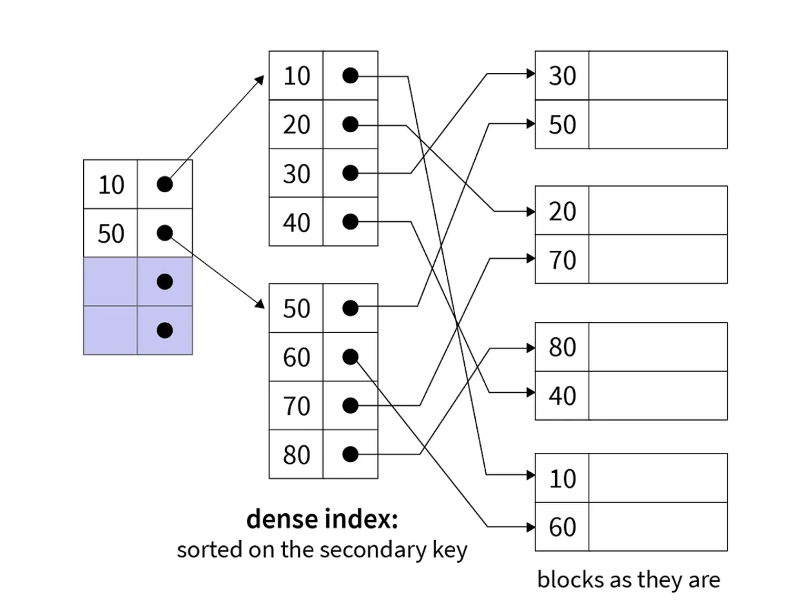

## What is an Index?

Think of a database index like the index at the back of a textbook — instead of reading every page, you look up the term, get the page number, and jump straight there.

An index is a smaller, separate data structure that maps **search-key values** to their records in the main table. Each entry in an index file is called an **index entry** and looks like this:

| search-key | pointer |
|:---:|:---:|
| "Pabitra Mitra" | → record #6 |

There are two broad families:

- **Ordered indices** — entries are sorted on the search key.
- **Hash indices** — entries are scattered into buckets using a hash function. Fast for exact lookups, but can't handle range queries.

This section focuses on ordered indices.

---

## Ordered Indices: Primary vs. Secondary

**Primary index (clustering index):** The index whose search key matches the physical order of the data file. Efficient for sequential scans since adjacent records on disk are also logically adjacent.

**Secondary index (non-clustering index):** An index on a different attribute than the one the file is sorted on. Pointers are scattered across the disk, so sequential scans are expensive.

> ⚠️ A table can have **only one primary index** but **many secondary indices**.

An **index-sequential file** is a sequentially ordered file paired with its primary index, also called ISAM (Indexed Sequential Access Method).

---

## Dense vs. Sparse Indexes

### Dense Index

One index entry for **every record** in the data file.



*Advantage*: Can check record existence from the index alone.  
*Disadvantage*: Index grows proportionally with the data.

### Sparse Index

One index entry per **disk block** (not per record).



To find key $K$: find the largest index entry $≤ K$, follow its pointer to the block, then scan within the block.

*Advantage*: Much smaller index, less maintenance.  
*Disadvantage*: Slightly slower — requires a sequential scan within the block.

> 💡 One sparse index entry per disk block is the standard trade-off — small enough for memory, granular enough to avoid long scans.

Secondary indices must be dense because records with a given secondary key are scattered across the file — a sparse index would miss records not sitting at a block boundary.

---

## Multilevel Index

**Problem:** If the primary index itself is too large to fit in memory, searching it becomes expensive.

**Solution:** Build a sparse index *on top of* the primary index.

- **Inner index** — the primary index file (on disk).
- **Outer index** — a sparse index of the inner index (fits in memory).

Lookup path: outer index (memory) → inner index block → data record.



If even the outer index is too large, add another level. This layering idea is the foundation of B-trees.

---

## Index Updates

### On Deletion

- If the deleted record was the **only** one with that key value, remove the index entry.
- **Dense:** treat like a sorted-list deletion.
- **Sparse:** replace the entry with the next key in the block; if the next key already has its own entry, just delete the current one.

### On Insertion

- **Dense:** if the key is absent from the index, insert a new entry in sorted order.
- **Sparse:** no change needed unless a new disk block is created — if so, add an entry for the first key in that new block.

Multilevel updates follow the same logic, applied at each level recursively.

---

## Index Definition in SQL

```sql
-- Create a basic index
CREATE INDEX emp_ename ON emp_tab(ename);

-- Create a unique index (enforces candidate key constraint)
CREATE UNIQUE INDEX emp_email ON emp_tab(email);

-- Create a composite index on two columns
CREATE INDEX emp_comp ON emp_tab(ename, empno) COMPUTE STATISTICS;

-- Function-based index (precomputes the function result for each row)
CREATE INDEX emp_upper ON emp_tab(UPPER(ename)) COMPUTE STATISTICS;

-- Bitmap index (best for columns with few distinct values)
CREATE BITMAP INDEX idx_gender ON student(gender);

-- Drop an index
DROP INDEX emp_ename;
```

> 💡 `COMPUTE STATISTICS` tells the optimizer to gather column statistics at index creation time — important for the optimizer to make good decisions.

> 📌 `CREATE UNIQUE INDEX` is technically redundant if you've already declared the column as `UNIQUE` in the table definition — the constraint is preferred.

---

## Guidelines for Indexing

Indexing is an ongoing task — query patterns change, tables grow, and indexes need to be monitored and adjusted over time.

- *Rule 1*: Index the Correct Tables
- *Rule 2*: Index the Correct Columns
- *Rule 3*: Limit the Number of Indexes for Each Table
- *Rule 4*: Choose the Order of Columns in Composite Indexes
- *Rule 5*: Gather Statistics to Make Index Usage More Accurate
- *Rule 6*: Drop Indexes That Are No Longer Required

## Formulas for Solving the Problem

$$\text{Space of Index} = \text{Size of Key Field} + \text{Size of Pointer Field}$$

$$\text{Total Index Space} = \text{Space of Index} \times \text{No. of Records}$$

$$\text{One Block Size} = \frac{\text{Size of File}}{\text{No. of Blocks Used to Store the File}}$$

$$\text{No. of Blocks for Index} = \left\lceil \frac{\text{Total Index Space}}{\text{One Block Size}} \right\rceil$$

> 💡 Always round **up** — a partial block still occupies a full block on disk.