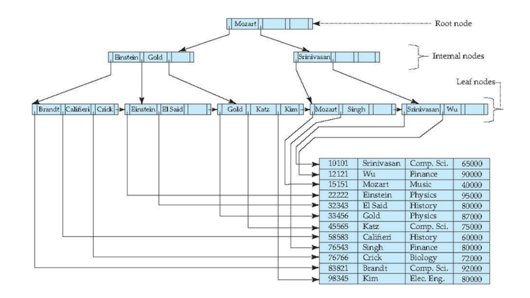
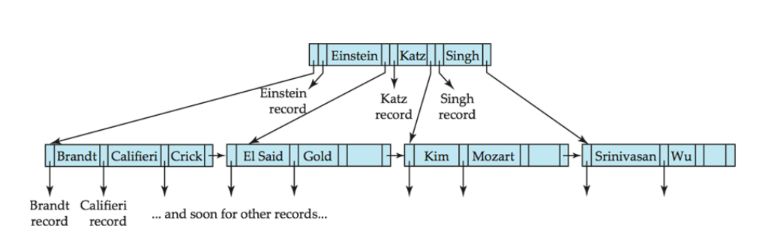

## Why Trees for Indexing?

The multilevel index from Section 1 was a good idea, but it had one major problem: as the file grows, overflow blocks pile up and performance degrades. You eventually need to reorganize the whole file — expensive and disruptive.

Tree-based structures solve this by **self-balancing on every insert and delete**, keeping search cost at $O(\log n)$ always, without any manual reorganization.

---

## The 2-3-4 Tree: Motivation

The problem with BSTs on disk is that each **node holds only one key and has only two children**. The tree must be very tall ($O(\log n)$ levels) to hold $n$ records.

What if we could make each node **fatter** — storing multiple keys and having multiple children? Then the tree would be much **shorter**, and we'd need far fewer disk reads to reach any record. This idea leads to the **2-3-4 Tree**.

---

## What Is a 2-3-4 Tree?

A 2-3-4 Tree is a balanced search tree where every node can hold **1, 2, or 3 keys** (and correspondingly have **2, 3, or 4 children**). That is where the name comes from.

**The three node types:**

| Node type | Keys stored | Children | Search key rule |
|:---:|:---:|:---:|---|
| **2-node** | 1 (call it S) | 2 | left child < S; right child > S |
| **3-node** | 2 (S and L) | 3 | left < S; middle: S–L; right > L |
| **4-node** | 3 (S, M, L) | 4 | left < S; second: S–M; third: M–L; right > L |

A leaf node can hold 1, 2, or 3 data items.

**Key properties:**

- All leaves sit at the **same depth** — the tree is always perfectly height-balanced.
- $h \sim O(\log n)$, so search, insert, and delete all cost $O(\log n)$.
- Data is always kept in **sorted order**.

---

## Search in a 2-3-4 Tree

Search is a straightforward extension of BST search. At each node, compare the target key against the node's keys and follow the appropriate child pointer. Repeat until you reach a leaf or find the key.

> 💡 Because all leaves are at the same depth, every search takes exactly $O(h) = O(\log n)$ steps — no worst-case skew possible.

---

## Insertion in a 2-3-4 Tree

Insertion always happens at a **leaf**. The process:

1. Search for the expected location (the leaf where the key would go).
2. If the leaf is a **2-node**, expand it to a **3-node** and insert. Done.
3. If the leaf is a **3-node**, expand it to a **4-node** and insert. Done.
4. If the leaf is a **4-node**, we can't add another key — we must **split** it first.

### Node Splitting

Splitting a 4-node takes its **middle key (M)** and pushes it up to the parent. The original 4-node becomes two 2-nodes (one holding S, one holding L), both children of the parent which now absorbs M.

There are three cases depending on the parent:

**Case 1 — Parent is the root (a 4-node):**

```
    [S  M  L]          [M]
   /  |  |  \    →    /   \
  a   b  c   d      [S]   [L]
                   / \   / \
                  a   b c   d
```

The tree grows one level taller.

**Case 2 — Parent is a 2-node:**

The middle key M is absorbed into the parent, converting it from a 2-node to a 3-node. The split 4-node's two halves (S and L) become two separate children.

**Case 3 — Parent is a 3-node:**

Same idea — M is absorbed, converting the parent from a 3-node to a 4-node.

### Early vs. Late Splitting

There are two strategies for *when* to split:

- **Early splitting:** Split any 4-node you *encounter* on the way down during a search, before you actually need to. This ensures you never have a full node at the insertion point. At most one split per level.
- **Late splitting:** Only split when you actually need to insert into a 4-node. May cascade up $O(h)$ splits in the worst case.

Both strategies produce valid trees with the same complexity $O(h)$, but they produce different final shapes. The slides follow the **early splitting** strategy.

---

## Insertion Example: Step by Step

Inserting the sequence **10, 30, 60, 20, 50, 40, 70, 80, 15, 90, 100** using the **early splitting** strategy.

---

**After inserting 10, 30, 60** — all three fit into one leaf (a 4-node):

```
[10  30  60]
```

---

**Insert 20** — the root is a 4-node, so we split it *before* descending. Middle key 30 becomes the new root; 10 and 60 become separate children. Then 20 is inserted into the left child:

```
        [30]
       /    \
  [10, 20]  [60]
```

---

**Insert 50** — 50 > 30, go right. [60] is a 2-node, so just expand it:

```
        [30]
       /    \
  [10, 20]  [50, 60]
```

---

**Insert 40** — 40 > 30, go right. [50, 60] is a 3-node, expand to 4-node and insert:

```
        [30]
       /    \
  [10, 20]  [40, 50, 60]
```

---

**Insert 70** — root [30] is fine. 70 > 30, descend right. [40, 50, 60] is a 4-node — split it immediately (early strategy). Middle key 50 rises to join the root:

```
           [30, 50]
          /   |    \
   [10,20]  [40]  [60]
```

Now insert 70 into the right child [60]:

```
           [30, 50]
          /   |    \
   [10,20]  [40]  [60, 70]
```

---

**Insert 80** — 80 > 50, go to right child [60, 70]. It's a 3-node, expand it:

```
           [30, 50]
          /   |    \
   [10,20]  [40]  [60, 70, 80]
```

---

**Insert 15** — 15 < 30, go left. [10, 20] is a 3-node, expand it:

```
              [30, 50]
             /   |    \
  [10, 15, 20]  [40]  [60, 70, 80]
```

---

**Insert 90** — root [30, 50] is fine. 90 > 50, descend right. [60, 70, 80] is a 4-node — split it. Middle key 70 rises to join the root:

```
                [30, 50, 70]
               /   |    |   \
  [10,15,20]  [40] [60] [80]
```

Now insert 90 into the rightmost child [80]:

```
                [30, 50, 70]
               /   |    |   \
  [10,15,20]  [40] [60] [80, 90]
```

---

**Insert 100** — root [30, 50, 70] is a 4-node — split it first. Middle key 50 becomes the new root; 30 and 70 become children:

```
                      [50]
                     /    \
                  [30]    [70]
                 /    \   /   \
          [10,15,20] [40] [60] [80,90]
```

Now insert 100. 100 > 50 → go right to [70]. 100 > 70 → go to right child [80, 90]. It's a 3-node, expand it:

```
                      [50]
                     /    \
                  [30]    [70]
                 /    \   /   \
          [10,15,20] [40] [60] [80, 90, 100]
```

---

**Final tree** after all 11 insertions:

```
                         [50]
                        /    \
                     [30]    [70]
                    /    \   /   \
             [10,15,20] [40][60] [80,90,100]
```

Height = 2. All 11 keys stored, all leaves at the same level. 

---

## Deletion in a 2-3-4 Tree

Deletion is the reverse of insertion. The core idea:

1. Locate the node containing the target key.
2. Swap it with its **inorder successor** (the smallest key in the right subtree). This reduces deletion to always happening at a **leaf**.
3. If the leaf is a 3-node or 4-node, simply remove the key.
4. If the leaf is a 2-node, removing its only key would leave an empty node — which is illegal. To prevent this, **transform every 2-node you encounter** (on the way down) into a 3-node or 4-node first. This is the reverse of the splitting cases from insertion.

### Deletion Example

We will delete **30** and then **50** from the final tree above.

**Starting tree:**

```
                         [50]
                        /    \
                     [30]    [70]
                    /    \   /   \
             [10,15,20] [40][60] [80,90,100]
```

---

**Delete 30**

30 is an internal node. Its inorder successor is **40** (smallest key in its right subtree). Swap 30 and 40:

```
                         [50]
                        /    \
                     [40]    [70]
                    /    \   /   \
             [10,15,20] [30][60] [80,90,100]
```

Now delete 30 from the leaf [30]. That leaf is a 2-node — but since 30 is the only key, removing it would leave an empty node.

However, looking at its sibling [10, 15, 20] (a 4-node), we can **borrow** from it. The sibling's largest key (20) rotates up to the parent, and the parent's key (40) rotates down to fill the now-empty spot:

```
                         [50]
                        /    \
                     [20]    [70]
                    /    \   /   \
             [10,15]  [40][60] [80,90,100]
```

30 is deleted. The tree remains balanced and all leaves are still at the same depth. 

---

**Delete 50**

50 is the root. Its inorder successor is **60** (smallest key in its right subtree). Swap 50 and 60:

```
                         [60]
                        /    \
                     [20]    [70]
                    /    \   /   \
             [10,15]    [40][50] [80,90,100]
```

Now delete 50 from the leaf [50]. It is a 2-node with no siblings to borrow from (both [20] and [60] in the right subtree are also 2-nodes).

In this case, we **merge**: combine the 2-node [50] with its sibling [60] (oops — actually [60] is now the root, not a sibling). Let's be precise: the right child of the root is [70], whose left child is [50] and right child is [80,90,100]. Since [50] is a 2-node and we must delete from it, we can borrow from the rich sibling [80, 90, 100]. The sibling's smallest key (80) rotates up to the parent [70], and 70 rotates down to fill the gap:

```
                         [60]
                        /    \
                     [20]    [80]
                    /    \   /   \
             [10,15]    [40][70] [90,100]
```

50 is deleted. Final tree:

```
                         [60]
                        /    \
                     [20]    [80]
                    /    \   /   \
               [10,15]  [40][70] [90,100]
```

Still height 2, all leaves at the same depth. 

> 📌 **Key takeaway from deletion:** The 2-3-4 tree never lets a node go empty. If you need to delete from a 2-node, you always first fatten it up — either by borrowing from a sibling or by merging with a sibling — before removing the key. This is the structural guarantee that keeps the tree balanced after every operation.

---

## B+ Trees

ISAM (indexed-sequential files) degrades as the file grows — overflow blocks pile up and require periodic full reorganization. B+ trees fix this by **self-balancing on every insert and delete**.

With $n = 100$ and 1 million records, B+ Tree needs 4 reads. A balanced BST on the same data needs ~20 disk reads. Each read costs ~20ms — the difference is significant at scale.

---

## Structure

A B+ tree with parameter $n$:

| Node | Min | Max |
|---|---|---|
| Internal (non-root) | $\lceil n/2 \rceil$ children | $n$ children |
| Root (non-leaf) | 2 children | $n$ children |
| Leaf | $\lceil (n-1)/2 \rceil$ values | $n-1$ values |
| Root as leaf | 0 values | $n-1$ values |

- All paths root → leaf are the **same length**.
- Keys in each node are ordered: $K_1 \leq K_2 \leq \cdots \leq K_{n-1}$.
- Leaf nodes are **linked** → supports sequential (range) access.
- **Leaf:** $P_i$ → record with key $K_i$; last pointer $P_n$ → next leaf.
- **Internal:** $P_i$ → subtree. Keys in $P_1 < K_1$; keys in $P_i \geq K_{i-1}$ and $< K_i$; keys in $P_n \geq K_{n-1}$.



---

## Search

To find value $V$:

1. Start at the root.
2. At each internal node, scan the keys left to right and find where 𝑉 fits. Follow the pointer to the matching child subtree. Repeat until you reach a leaf.
3. At the leaf, scan for 𝑉. If found, follow its pointer to the record. If not, the record doesn't exist.

**Duplicates:** ordering relaxes to $\leq$. Always descend $P_i$ when $V = K_i$ — duplicates may exist in the left subtree. To find all occurrences, traverse consecutive leaves via the linked list.

---

## Insertion

1. Find the target leaf and insert in sorted order.
2. **If space exists** → insert. Done.
3. **If leaf is full** → split:
   - Put first $\lfloor n/2 \rfloor$ pairs in original node, rest in new node.
   - Push smallest key of new node up to parent.
4. If parent is also full → split it and propagate upward.
5. Worst case: root splits, tree grows one level taller.

---

## Deletion

1. Remove the record and its (key, pointer) from the leaf.
2. **Node still has enough entries** → done.
3. **Underfull + can merge with sibling** → combine into one node; pull separator key down from parent; recurse upward.
4. **Underfull + cannot merge** → redistribute from sibling; update separator key in parent.
5. If root ends up with one child → delete root, promote that child.

---

## B-Tree vs B+ Tree

B-tree eliminates key duplication — each key appears **once** across the whole tree, with record pointers directly in internal nodes.



| | B+ Tree | B-Tree |
|---|---|---|
| Keys in internal nodes | Routing copies only | Actual record pointers |
| Key duplication | Yes | No |
| Leaf nodes linked | Yes | No |
| Fan-out | Higher | Lower |
| Sequential access | Efficient | Inefficient |
| Early key find | No | Sometimes |
| Complexity | Simple | More complex |
