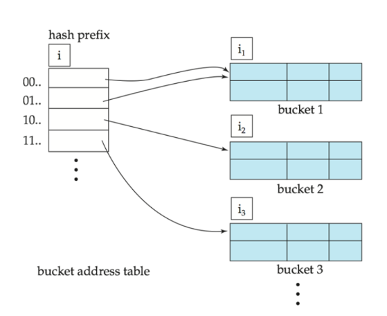

## What is Hashing?

Instead of searching through a sorted structure, hashing computes **exactly which bucket** a record lives in — no traversal needed. Think of it as a direct address calculator.

A **hash function** $h$ maps a search key to a bucket address:

$$h : \text{search-key values} \rightarrow \text{bucket addresses}$$

- A **bucket** is a unit of storage — typically one disk block — holding one or more records.
- If $h(k_1) = h(k_2)$ for $k_1 \neq k_2$, a **collision** has occurred.

A good hash function is **uniform** (distributes keys evenly across all buckets) and **fast** to compute.

> ⚠️ The worst hash function maps every key to the same bucket — search degrades to $O(n)$.

---

## Static Hashing

The number of buckets $B$ is **fixed** at creation time.

**Lookup:** compute $h(k)$ → go directly to that bucket → scan within it sequentially.

**Example:** 10 buckets, keys are department names. Hash = sum of character values mod 10.

```
h(Music)      = 1    h(History)   = 2
h(Physics)    = 3    h(Elec. Eng.) = 3   ← collision
```

Physics and Elec. Eng. both map to bucket 3. Both records are stored there and the bucket is scanned sequentially to find the right one.

---

## Handling Bucket Overflow

Overflow happens when a bucket fills up. Causes:

- Too few buckets allocated initially.
- **Skew** — many records share the same key, or the hash function distributes unevenly.

**Solution: overflow chaining** — link overflow buckets to the original in a linked list.

```
Bucket 3: [Physics | Elec. Eng.] → [overflow block] → ...
```

This scheme is called **closed hashing**. 

---

## Deficiencies of Static Hashing

The fixed bucket count $B$ is the core problem:

| Scenario | Problem |
|---|---|
| File grows beyond initial estimate | Too many overflow chains → poor performance |
| File shrinks | Mostly empty buckets → wasted space |
| $B$ set too large from the start | Space wasted immediately |

Periodic full reorganization with a new hash function is possible but expensive and disruptive.

**Better fix:** let the number of buckets grow and shrink dynamically.

---

## Dynamic Hashing (Extendable Hashing)

Instead of a fixed bucket count, extendable hashing uses a **directory** (bucket address table) that doubles or halves as needed.

### Core Idea

- The hash function produces a **$b$-bit integer** (typically $b = 32$).
- Only the **first $i$ bits** (global depth) are used to index into the directory.
- Directory size = $2^i$. Initially $i = 0$.
- Each bucket $j$ stores its own **local depth $i_j$** — how many bits actually identify its entries.
- Multiple directory entries can point to the **same bucket** when $i_j < i$.



---

### Lookup

1. Compute $h(k) = X$.
2. Use the first $i$ bits of $X$ as a directory index.
3. Follow the pointer to the bucket and scan within it.

---

### Insertion

1. Lookup the target bucket $j$.
2. If space exists → insert. Done.
3. If bucket $j$ is full → **split**:

**Case 1 — $i > i_j$ (multiple entries point to $j$):**
- Allocate new bucket $z$, set $i_j = i_z = i_j + 1$.
- Redirect the second half of entries that pointed to $j$ → now point to $z$.
- Redistribute all records in $j$ between $j$ and $z$ by recomputing hash prefixes.
- Retry insertion.

**Case 2 — $i = i_j$ (only one entry points to $j$):**
- Increment $i$, double the directory (each old entry becomes two entries pointing to the same bucket).
- Now $i > i_j$ → apply Case 1.
- If $i$ hits limit $b$ or too many splits occur, use an overflow bucket instead.

---

### Deletion

1. Remove the record from its bucket.
2. If the bucket empties, it can be removed.
3. **Coalesce** with a "buddy" bucket — a bucket with the same $i_j$ and the same $(i_j - 1)$-bit prefix.
4. Shrink the directory if the actual bucket count becomes much smaller than $2^i$ (expensive — do sparingly).

---

### Extendable Hashing: Pros and Cons

| ✓ Advantages | ✗ Disadvantages |
|---|---|
| Performance doesn't degrade as file grows | Extra level of indirection on every lookup |
| Minimal space overhead | Directory can exceed memory size |
| No periodic reorganization needed | Doubling the directory is expensive |

> 💡 If the directory outgrows memory, a B+ tree can index into it — combining the benefits of both structures.

---

## Bitmap Indices

Bitmap indices are designed for **multi-attribute analytical queries** on low-cardinality columns — not for point lookups.

### What They Are

For an attribute with $m$ distinct values, a bitmap index stores **$m$ bit vectors** — one per distinct value. Each bit vector has one bit per record:

- **1** if the record has that value.
- **0** otherwise.

**Example:** `gender` attribute, 5 records:

```
Record:     0  1  2  3  4
Gender:     M  F  M  F  M

Bitmap(M):  1  0  1  0  1
Bitmap(F):  0  1  0  1  0
```

> 📌 Best suited for columns with **few distinct values** — gender, country, income bracket, status flags. Not useful for high-cardinality columns like names or IDs.

---

### Answering Queries with Bitmaps

Multi-attribute queries use **bitwise operations** — extremely fast at the CPU level.

| Operation | Meaning |
|---|---|
| AND | Records matching both conditions |
| OR | Records matching either condition |
| NOT | Records not matching a condition |

**Example:** find male instructors at income level L1:

```
Bitmap(gender=M):    1 0 0 1 0
Bitmap(income=L1):   1 0 1 1 0
                     ---------
AND result:          1 0 0 1 0   → records 0 and 3 match
```

---

